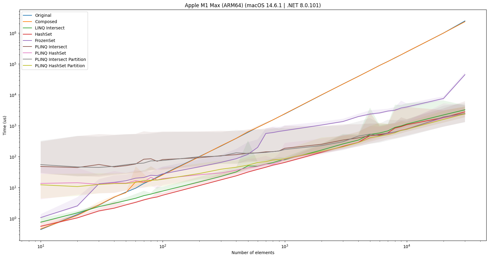
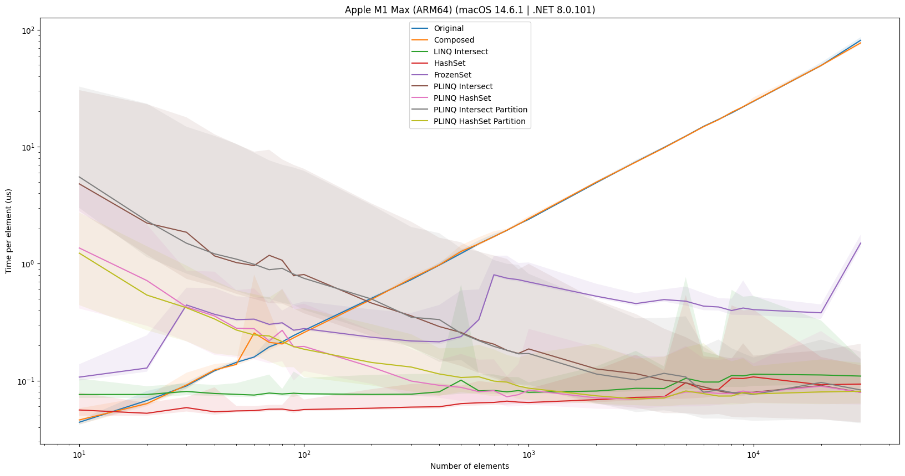
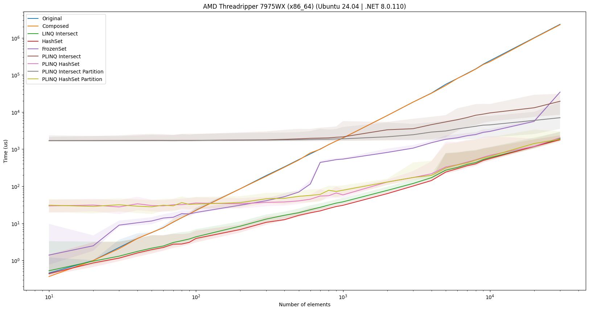
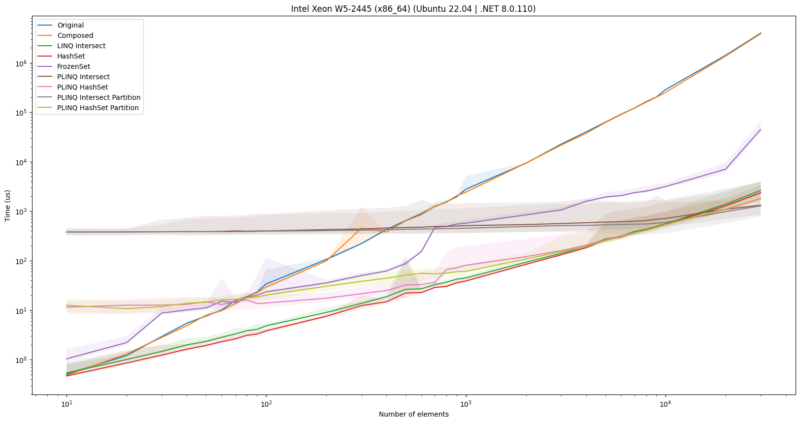
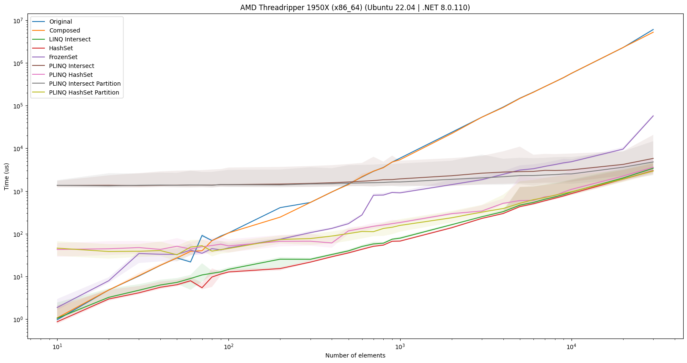
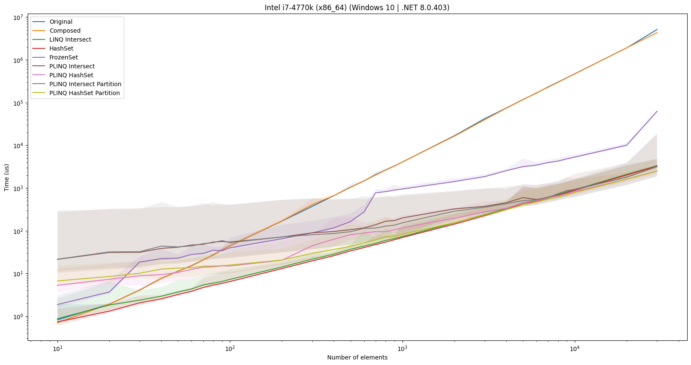
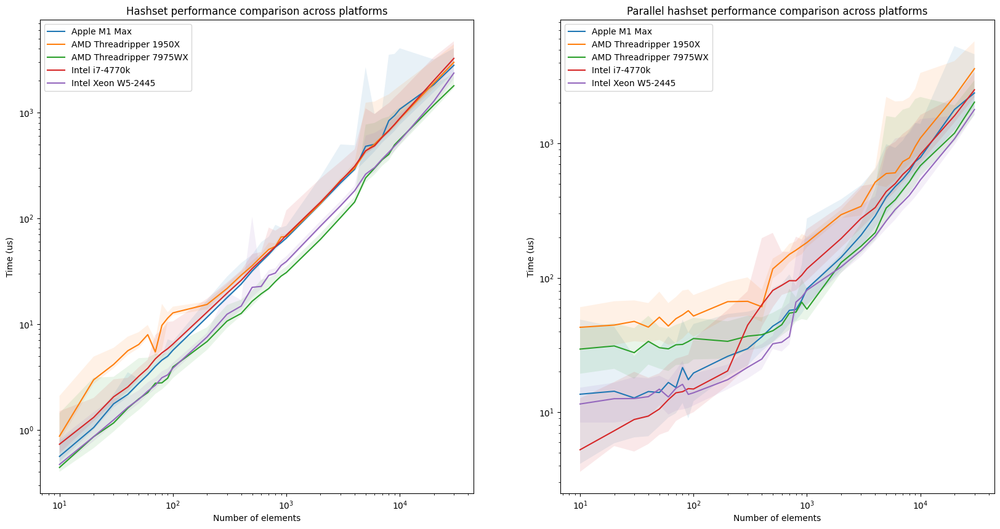

# Speeding up inner workings of `DoCompact()` by up to 1000x
During the benchmarking of Duplicati under different parameter configurations, one particular step in the process took up a considerable amount of time (20 minutes out of the 65 minute total runtime). This blog post describes the identification of the problem, the solution, and the resulting impact. The solution has been merged in the pull request [\#5595](https://github.com/duplicati/duplicati/pull/5595).

# TL:DR; Two LINQ queries were the culprits.
By changing the underlying data structure of the two LINQ queries, the were sped up by up to 4 orders of magnitude, essentially removing their impact.


# Machine and setup
All of the plots and data shown here are performed on a MacBook Pro 2021 with an M1 Max chip, running macOS Sonoma 14.6.1. All of the benchmarks were run with `dotnet run -c Release`. Other things were running on the machine during the benchmarks, but the machine was not under heavy load, so the results should be valid. The folder being backed up has 3449 files, 677 folders totaling 68 GB, amongst which there are duplicates. The remote storage is a workstation on a 10 GbE local network over SSH to a RAID 5 array of 8 HDDs, so that shouldn't be a bottleneck.

# Identification
I was stress testing Duplicati to identify performance issues that I could tackle as part of my quest to speed up Duplicati.
One such issue that is known is that for small block sizes, identifying whether a data block has been seen before can take up a considerable amount of time due to the local database increasing in size.
As such, I was trying to perform a backup under different parameter configurations, in particular with small block sizes.
As I was tuning the `--dblock-size` (size of volumes) parameter, I noticed an extreme slowdown:

| `dblock-size` | Runtime   | Relatively slower |
|---------------|-----------|-------------------|
| 50 MB         |  4:23.096 |            1.000x |
|  5 MB         |  4:27.627 |            1.017x |
|  1 MB         | 55:16.227 |           12.604x |

Wow, more than 10 times slower, that seems excessive. Let's dive further by profiling the exact same call with `--dblock-size` 50 and 1:


The first thing we notice is that it looks like the same type of workload shown in the 50 profiling is the same as the first 3rd of the 1 profiling.
Thus, it looks like the 1 is doing something more. Diving further, we found that the issue was that due to `--dblock-size` and `--block-size` being equivalent, the backup run would perform a compact every time, due to the sizes always matching up. While the triggering of the compact was unintended, it pointed out a performance issue in the compacting process.

Looking at the console output, we see that it stalls right after processing all of the blocks, and before performing the download, check and delete steps. This indicates that the issue is in the prelininary steps of the compacting process. Zooming into that part of the profiling highlights the issue:


Here we see that the majority of the time spent is spent on LINQ and Collections operations. If we look into the code, we see that the two LINQ queries (`Duplicati/Library/Main/Operation/CompactHandler.cs` previously lines 131-133,144-146):

```csharp
 var fullyDeleteable = (from v in remoteList
                        where report.DeleteableVolumes.Contains(v.Name)
                        select (IRemoteVolume)v).ToList();

...

    var volumesToDownload = (from v in remoteList
                             where report.CompactableVolumes.Contains(v.Name)
                             select (IRemoteVolume)v).ToList();
```

Timing the two queries using `Stopwatch` cements the issue: the first query takes X seconds and the second query takes Y seconds - a total of 25 minutes.

# Solution
The issue with both of these queries is that they compare two `List<string>`, which means that the `select` will take n elements and perform the `Contains` operation, which is also O(n). This means that each of the two queries are O(n^2), which is not ideal.

There are multiple ways to solve this issue, but let's test a few of them:
1. As a sanity check, convert the query to use compositional LINQ methods, as this may leave more to the LINQ engine to optimize.
2. Change the query to use the LINQ `Intersect` method, as this is the intended operation. This method leaves more to the LINQ engine to optimize, potentially resulting in a faster query.
3. Change the underlying data structure of one of the `List<string>` to a `HashSet<string>`, which has O(1) lookup time. Assuming the `HashSet<string>` can be built in O(n), this would make each of the queries O(n) instead of O(n^2) at the cost of O(n) setup time, resulting in a total of O(n+n) = O(n) instead of O(n^2).
4. Apply (3), but go even further and convert the `HashSet<string>` to a `FrozenSet` which leverages immutability to allow for even faster lookups.
5. (2) but using PLINQ to parallelize the query, as this may benefit particularly large lists.
6. (3) but using PLINQ to parallelize the query.
7. (5) but using `Partitioner` to chunk the `List<string>` into smaller parts to allow for more work per thread.
8. (6) but using `Partitioner` to chunk the `List<string>`.

To properly gauge each of these solutions, we construct a micro benchmark.

## Microbenchmark
```csharp
Tuple<double, double, double, double> time_func(Func<List<string>, List<string>, List<string>> f, List<string> a, List<string> b, int warmup = 10, int runs = 1000)
{
    for (int i = 0; i < warmup; i++)
    {
        f(a, b);
    }

    double[] times = new double[runs];
    double min = double.MaxValue, max = double.MinValue;
    var sw = new System.Diagnostics.Stopwatch();
    for (int i = 0; i < runs; i++)
    {
        sw.Restart();
        f(a, b);
        sw.Stop();
        // In microseconds
        times[i] = sw.ElapsedTicks / (double)System.Diagnostics.Stopwatch.Frequency * 1000000;
        min = Math.Min(min, times[i]);
        max = Math.Max(max, times[i]);
    }

    double mean = times.Average();
    double std = Math.Sqrt(times.Select(x => Math.Pow(x - mean, 2)).Sum() / (runs - 1));

    return new Tuple<double, double, double, double>(mean, std, min, max);
}
```

This function takes the function to test `f`, two `List<string>` `a` and `b`, and the number of warmup runs and runs to perform. It then removes 1 % of outliers in each end, and finally reports the mean, standard deviation, minimum and maximum time taken in microseconds.
For each of the proposed solutions, we construct a function that takes two `List<string>` and returns a `List<string>`:

```csharp
List<string> original_linq(List<string> a, List<string> b)
{
    return (from x in a
        where b.Contains(x)
        select x).ToList();
}

List<string> std_linq(List<string> a, List<string> b)
{
    return a.Intersect(b).ToList();
}

List<string> compose_linq(List<string> a, List<string> b)
{
    return a.Where(b.Contains).ToList();
}

List<string> hashset_linq(List<string> a, List<string> b)
{
    var b_set = new HashSet<string>(b);
    return a.Where(b_set.Contains).ToList();
}

List<string> frozenset_linq(List<string> a, List<string> b)
{
    var b_set = new HashSet<string>(b).ToFrozenSet();
    return a.Where(b_set.Contains).ToList();
}

List<string> par_std_linq(List<string> a, List<string> b)
{
    return a.AsParallel().Intersect(b.AsParallel()).ToList();
}

List<string> par_hashset_linq(List<string> a, List<string> b)
{
    var b_set = new HashSet<string>(b);
    return a.AsParallel().Where(b_set.Contains).ToList();
}

List<string> par_std_linq_partition(List<string> a, List<string> b)
{
    return Partitioner.Create(a, true).AsParallel().Intersect(b.AsParallel()).ToList();
}

List<string> par_hashset_linq_partition(List<string> a, List<string> b)
{
    var b_set = new HashSet<string>(b);
    return Partitioner.Create(a, true).AsParallel().Where(b_set.Contains).ToList();
}
```


We generate two random `List<string>` with a varying amount of known duplicate values, using the following code:
```csharp
List<string> generate_strings(Random rng, int n) {
    return Enumerable
        .Range(0, n)
        .Select(_ => {
            byte[] tmp = new byte[32];
            rng.NextBytes(tmp);
            return Convert.ToBase64String(tmp);
        })
        .ToList();
}

(List<string>,List<string>) generate_string_pair(Random rng, int n, int overlap) {
    var a = generate_strings(rng, n);
    var overlap_elements = n * overlap / 100;
    var b = generate_strings(rng, n - overlap_elements)
        .Concat(a.Take(overlap_elements))
        .OrderBy(_ => rng.Next()) // Shuffle
        .ToList();
    return (a, b);
}
```

We then generate two `List<string>` with a varying amount of overlap and varying data size and perform the timing:
```csharp
for (int i = 1; i <= 10; i++)
{
    var overlap = i * 10; // Percentage
    for (int j = 1; j < 5; j++)
    {
        int k_end = j == 4 ? 4 : 10; // Earlier stopping on the last iteration
        for (int k = 1; k < k_end; k++)
        {
            int n = (int) Math.Pow(10, j) * k;
            var (a,b) = generate_string_pair(rng, n, overlap);

            var original = time_func(org_linq, a, b);
            var standard = time_func(std_linq, a, b);
            ...
```

## Microbenchmark results
Each of the implementations have been run with 10 warmup runs and a 1000 runs, except for the original and composite versions, which have been run with 5 warmup and 10 runs due to their extremely slow performance.
We start by looking at the effect of each of overlapping data percantage for each of the solutions:


Here we see that the effect is somewhat neglible, so to simplify the results, we will only look at the 50% overlap case.


First of all, this plot cements the problem: the original solution scales very poorly, and quickly becomes much worse (notice that both axes are log scale). Second of all, we see that using LINQ composition doesn't change anything, which is to be expected.

The `Intersect` method is quite a bit faster, which is quite interesting since it should semantically be performing the same operation as the original query, but the LINQ engine is able to optimize the `Intersect` method better.

The `HashSet` implementation is even faster, which indicates that our hypothesis holds; the O(1) lookup time really benefits the query. Where the gap is largest (rightmost), the `HashSet` implementation is X times faster than the original implementation.

Interestingly, the `FrozenSet` implementation is much slower and becomes progressively worse as the data size increases. This is likely due to the extra overhead of constructing the `FrozenSet` from the `HashSet`, which is not worth it for the potential performance gain when performing lookups for a single pass over the data.

Finally, looking at the parallel implementations, we see that when the sizes become large enough, the overhead of starting up the parallel threads is worth it, making the parallel implementations faster than the serial ones. By using a `Partitioner` to chunk the data, the performance is further improved, as each thread can perform more work, leading to less context switching overhead. However, each of the parallel implementations are not several times faster than the serial ones, leading to them not being worth the extra complexity, work and resource consumption.

To provide another view of the results, we can look at the time spent per element:



Here we see that the original (and composite) solutions become progressively worse as the data size increases, while the rest of the solutions are stable (considering after the saturation point for the parallel implementations).

The final winner is the `HashSet` implementation, which is the fastest and is still sequential leading to a fast, low resource consuming solution. The `Intersect` is the runner up and looking into memory consumption it might provide a lower memory footprint, but this is not within the scope of this blog post.

## Microbenchmark across platforms
To ensure that the results are not only for a MacBook Pro, we also ran the microbenchmark on three Linux machines and a Windows machine. For completeness, here are the plots for the 50% overlap case on these machines:









As a bonus plot, just for the fun of it, we plot the scaling of `HashSet` and PLINQ `HashSet` across all platforms:



# Impact
Going back to the original motivation, we can now apply the `HashSet` implementation to the two LINQ queries in `CompactHandler.cs`:

```csharp
List<IRemoteVolume> fullyDeleteable = [];
if (report.DeleteableVolumes.Any())
{
    var deleteableVolumesAsHashSet = new HashSet<string>(report.DeleteableVolumes);
    fullyDeleteable =
        remoteList
            .Where(n => deleteableVolumesAsHashSet.Contains(n.Name))
            .Cast<IRemoteVolume>()
            .ToList();
}

...

    List<IRemoteVolume> volumesToDownload = [];
    if (report.CompactableVolumes.Any())
    {
        var compactableVolumesAsHashSet = new HashSet<string>(report.CompactableVolumes);
        volumesToDownload =
            remoteList
                .Where(n => compactableVolumesAsHashSet.Contains(n.Name))
                .Cast<IRemoteVolume>()
                .ToList();
    }
```

Note that we have also added guards around the statements, as there is no need to perform the LINQ query if there are no elements in the `report.DeleteableVolumes` or `report.CompactableVolumes`.
Looking at the profiling of the compacting process, we see that the time spent on the two LINQ queries has been reduced so that they are no longer listed in the call tree. Note also how the total profiling runtime went from 1 hour 5 minutes to 45 minutes; a 20 minute (31 %) reduction in total execution time.


And if we construct the same table as before, we see that the runtime has been reduced to:

| `dblock-size` | Runtime     | Relatively slower | Speedup compared to original |
|---------------|-------------|-------------------|------------------------------|
| 50 MB         | 00:04:40.67 |            1.000x |                       0.937x |
|  5 MB         | 00:04:53.78 |            1.046x |                       0.910x |
|  1 MB         | 00:42:44.82 |            9.138x |                       1.293x |

While there's still a problem to investigate, we've now sped up a part of the process, which shouldn't have been a bottleneck in the first place. Running a compact of a backup should now start up a lot faster, when there's a lot of files.