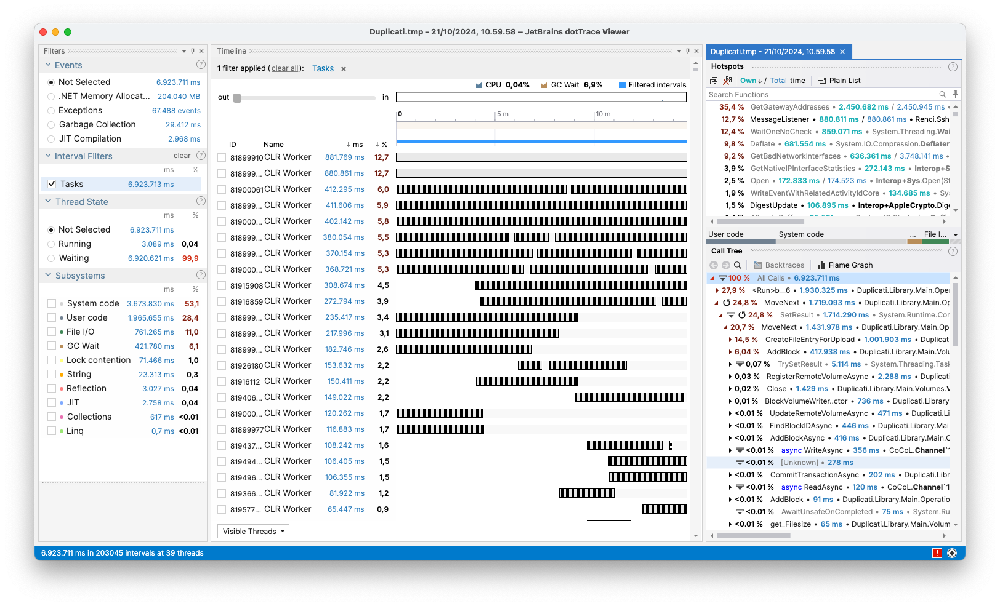
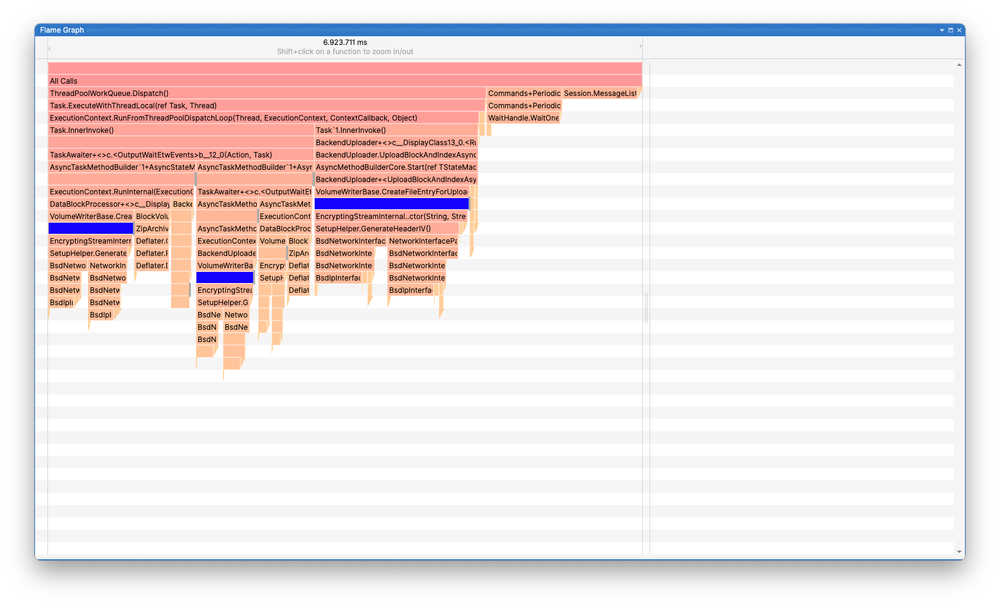
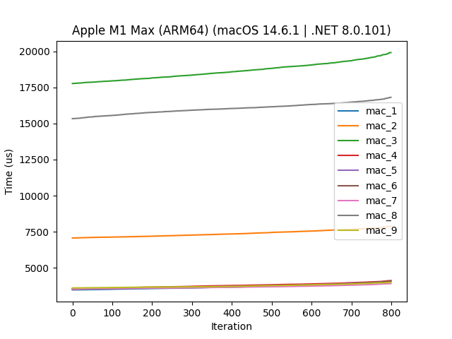
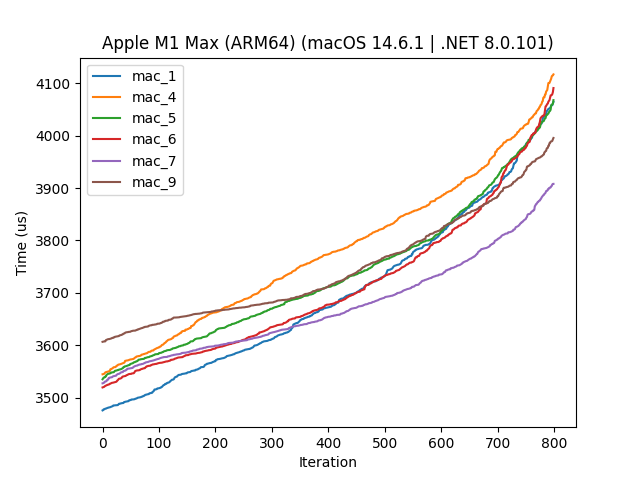
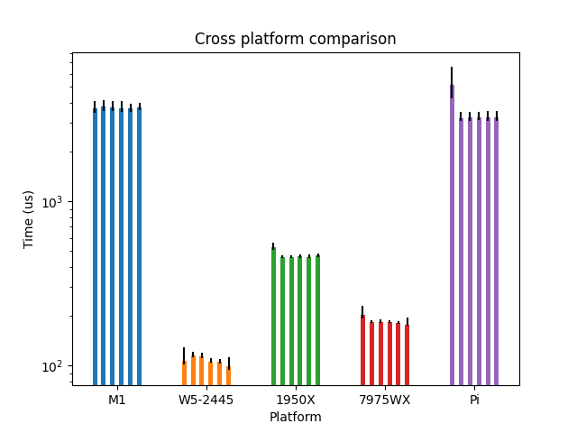

# Speeding up `GenerateHeaderIV()` by up to 1.85 times

# Introduction
When profiling a backup with many small volumes, a large portion of the time spent went to generating the AES header IV. This blog post describes the problem, the solution, and the performance improvements. The solution has been merged in the [sharpaescrypt project](https://github.com/duplicati/sharpaescrypt/) in pull request [\#1](https://github.com/duplicati/sharpaescrypt/pull/1) and published in the nuget package [SharpAESCrypt 2.0.3](https://www.nuget.org/packages/SharpAESCrypt/2.0.3), which is now used in Duplicati in the merged pull request [\#5597](https://github.com/duplicati/duplicati/pull/5597).

## TL;DR
The AES header IV generation was slow as it queried the operating system for a MAC address on every call (and it had an error, resulting in a default value being used). Fixing the error and caching the MAC address improved the performance by up to 1.85 times. This led to encryption being essentially free for this particular backup.

| Method        | Time `small` (mm:ss.ms) | Time `large` (mm:ss.ms) |
|---------------|------------------------:|------------------------:|
| Before        |     `00:27.120 (1.00x)` |     `09:58.841 (1.00x)` |
| Bugfix        |     `03:02.125 (0.29x)` |     `82:17.057 (0.12x)` |
| New query     |     `00:18.866 (1.43x)` |     `07:02.992 (1.41x)` |
| Cached MAC    |     `00:15.182 (1.78x)` |     `05:22.970 (1.85x)` |
| No encryption |     `00:13.859 (1.95x)` |     `05:00.736 (1.99x)` |

## Machine and Setup
All of the plots and data shown here are performed on the MacBook specified in the following table. All of the benchmarks were run with `dotnet run -c Release`. Other things were running on the machine during the benchmarks, but the machine was not under heavy load, so the results should be valid. The remote resource is a local raspberry pi, but all of the measurements in this blog post is performed as a dry run and should only use the remote resource during initialization. The following folders were used for the benchmarks:

| Name    |    Size |  Files | Folders |
|---------|--------:|-------:|--------:|
| `small` |  3.1 GB |    547 |       4 |
| `large` | 68.0 GB |  3,449 |     677 |

The following table shows the different machines mentioned:

| Machine | CPU | RAM | OS | .NET |
|---------|-----|-----|----|------|
| MacBook Pro 2021 | (ARM64) M1 Max 10-core (8P+2E) 3.2 GHz | 64 GB LPDDR5-6400 ~400 GB/s | macOS Sonoma 14.6.1 | 8.0.101 |
| AMD 7975WX | (x86_64) 32-core 4.0 GHz (5.3) | 512 GB DDR5-4800 8-channel ~300 GB/s | Ubuntu 24.04 LTS | 8.0.110 |
| AMD 1950X | (x86_64) 16-core 3.4 GHz (4.0) | 128 GB DDR4-3200 4-channel ~200 GB/s | Ubuntu 22.04 LTS | 8.0.110 |
| Intel W5-2445 | (x86_64) 10-core 3.1 GHz (4.6) | 128 GB DDR5-4800 4-channel ~150 GB/s | Ubuntu 22.04 LTS | 8.0.110 |
| Intel i7-4770k | (x86_64) 4-core 3.5 GHz (3.9) | 16 GB DDR3-1600 2-channel ~25 GB/s | Windows 10 x64 | 8.0.403 |
| Raspberry Pi 3 Model B | (ARM64) 4-core 1.2 GHz | 1 GB LPDDR2-900 ~6 GB/s | Raspbian 11 | 8.0.403 |

# Identification
The issue was identified when profiling a dry run of the `large` folder, where `GetGatewayAddresses()` (a call within `GenerateHeaderIV()`) was taking up 35.4 % of the time.



Which is further shown in the flame graph (the blue boxes indicate the functions that call `GenerateHeaderIV()`):



To confirm that this is the issue, we try to perform a dry run on the two folders with and without encryption. The results are as follows:


| Method        | Time `small` (mm:ss.ms) | Time `large` (mm:ss.ms) |
|---------------|------------------------:|------------------------:|
| Before        |     `00:27.120 (1.00x)` |     `09:58.841 (1.00x)` |
| No encryption |     `00:13.859 (1.95x)` |     `05:00.736 (1.99x)` |

So we see that encryption is the majority of the time as disabling it almost halves the time spent. This also gives us a lower bound for how fast we can become. Let's dive into the [`SharpAESCript.SetupHelper.GenerateHeaderIV()`](https://github.com/duplicati/sharpaescrypt/blob/fd536c089d4a06366f15e22d645bebed59e835f7/src/SetupHelper.cs#L146) method (lines 146-173):

```csharp
private static readonly ulong DEFAULT_MAC
        = BinaryPrimitives.ReadUInt64BigEndian([0x01, 0x23, 0x45, 0x67, 0x89, 0xab, 0xcd, 0xef]);

...

private ReadOnlyMemory<byte> GenerateHeaderIV()
{
    var mac = DEFAULT_MAC;
    try
    {
        var interfaces = System.Net.NetworkInformation.NetworkInterface.GetAllNetworkInterfaces();
        for (int i = 0; i < interfaces.Length; i++)
            if (i != System.Net.NetworkInformation.NetworkInterface.LoopbackInterfaceIndex)
            {
                mac = BinaryPrimitives.ReadUInt64BigEndian(interfaces[i].GetPhysicalAddress().GetAddressBytes());
                break;
            }
    }
    catch
    {
        //Not much to do, just go with default MAC
    }

    // Build some initial entropy
    var iv = new byte[Constants.IV_SIZE];
    BinaryPrimitives.WriteInt64BigEndian(iv.AsSpan(), DateTime.Now.Ticks);
    BinaryPrimitives.WriteUInt64BigEndian(iv.AsSpan(8), mac);

    // The IV is generated by repeatedly hashing the IV with random data.
    // By using the MAC address and the current time, we add some initial entropy,
    // which reduces risks from a vulnerable or tampered PRNG.
    return DigestRandomBytes(iv, Constants.IV_GENERATION_REPETITIONS);
}
```

In essence, this method tries to get the MAC address of the first non-loopback network interface and uses it as part of the IV to introduce more entropy. If it fails, it uses a default MAC address. The MAC address is then used as part of the IV, which is then hashed with random data to generate the IV. Whether this is the right method for gaining entropy is not the focus of this blog post, but the performance of the method is.

When running the method, we see the first problem: the `BinaryPrimitives.ReadUInt64BigEndian()` call tries to read 8 bytes, but a MAC address is only 6 bytes (or 0 bytes for some of the network interfaces on Mac). This results in an exception being thrown, and the default MAC address being used, regardless of whether an actual MAC address was found. This is a bug and adds unnecessary overhead due to the exception throwing and catching.

The second problem is that the MAC address is queried on every call to `GenerateHeaderIV()`. This is unnecessary, as the MAC address is not going to change during the lifetime of the application. This is a performance issue, as the call to `GetAllNetworkInterfaces()` is potentially slow depending on the platform and number of network interfaces (as will be shown later).

# Solution
## Step 1 - Fixing the bug
The first step is to fix the bug - we apply a naive approach by padding with zeros to the end of the MAC address.

```csharp
mac = BinaryPrimitives.ReadUInt64BigEndian([
    .. interfaces[i].GetPhysicalAddress().GetAddressBytes(),
    .. new byte[2]
]);
```

This fixes the bug, and the method now correctly reads the MAC address into an `ulong`.

## Step 2 - Speeding up the MAC address query
The second step is to speed up the MAC address query itself. To do so, we set up a microbenchmark to measure the time it takes different methods to query the MAC address. The following methods were tested:

1. **Isolated `GetAllNetworkInterfaces()`**: the original method, but isolated to only measure the time it takes to get the network interfaces.
2. **The original `try`/`catch` method with the bug**: using a `for` loop to iterate over all non loopback network interfaces and get the MAC address.
3. **The original `try`/`catch` method without the bug**: the same as 2, but with the bug fixed.
4. **Using LINQ and `FirstOrDefault()`**: using LINQ to perform the same query and handle the null result.
5. **LINQ but prefiltering with devices that are up**: using LINQ to filter out devices that are not up before querying the MAC address.
6. **5. but with filters reversed**: using LINQ to filter non loopback devices before filtering out devices that are not up.
7. **LINQ but filtering ethernet and wireless devices**: using LINQ to filter out devices that are not ethernet or wireless before querying the MAC address.
8. **Mac specific `ifconfig` regex query**: using a regex query on the output of `ifconfig` to get the MAC address.
9. **LINQ but choosing the first MAC address that's not empty or pure 0's**: rather than filtering on device type or status, we just take the first available MAC address.

Running with 100 warmup runs and 1000 iterations, we get the following (sorted) results on the Mac:


Alright, let's discard 10 % of the slowest and fastest runs:



Here we see that 2, 3 (the two original variations), and 8 (regex based platform dependant) are the slowest methods, so let's discard those to zoom in on the contenders:



There isn't really a clear winner across the board, as some of them beat `mac_1`, which is the isolated `GetAllNetworkInterfaces()` method, indicating some other hidden overhead, such as garbage collection or other system calls. So rather than choosing the method based on the microbenchmark, we choose based on the nature of the methods. We choose 9, as 1 isn't a replacement, 4, 5 and 6 all filter the devices (we just want any MAC address), and 7 is limited to only ethernet and wifi, of which there technically might not be one (or at least it could be wrongly classified).

To be sure that this choice is not Mac specific, we run the same microbenchmark across the other machines (with 2, 3 and 8 excluded):



Here we see that the results are consistent across the different machines, all being relatively close to each other. An interesting observation is that the two ARM machines are a lot slower than the x86_64 machines (notice the logarithmic y-scale), which is likely due to the different implementations of the `GetAllNetworkInterfaces()` method. It's also worth noting that Intel seems to be faster than AMD, which is also surprising.

## Step 3 - Caching the MAC address
The last optimization is to cache the MAC address, as it shouldn't change during a backup. We add a `static readonly` field to the `Constants` class to store the MAC address. It cannot be a constant, as it's a runtime value, but it can be `readonly` as it's only set once. To ensure that it won't crash, we add `try` / `catch` blocks around the initialization. Since this is only called once during the lifetime of the application, the added overhead is negligible.

```csharp
private static byte[] GetFirstMacAddress()
{
    byte[] default_mac = [0x01, 0x23, 0x45, 0x67, 0x89, 0xab];
    try {
        return System.Net.NetworkInformation.NetworkInterface
                .GetAllNetworkInterfaces()
                .Select(ni => { try { return ni.GetPhysicalAddress().GetAddressBytes(); } catch { return []; } })
                .Where(mac => mac.Length > 0 && !mac.All(b => b == 0))
                .FirstOrDefault(default_mac);
    } catch {
        return default_mac;
    }
}

internal static readonly ulong FIRST_MAC_ADDRESS = System.Buffers.Binary.BinaryPrimitives.ReadUInt64BigEndian(
[
    .. GetFirstMacAddress(),
    .. new byte[2],
]);
```

With this change, we can now replace the MAC address query in `GenerateHeaderIV()` with the cached value:

```csharp
private ReadOnlyMemory<byte> GenerateHeaderIV()
{
    // Build some initial entropy
    var iv = new byte[Constants.IV_SIZE];
    BinaryPrimitives.WriteInt64BigEndian(iv.AsSpan(), DateTime.Now.Ticks);
    BinaryPrimitives.WriteUInt64BigEndian(iv.AsSpan(8), Constants.FIRST_MAC_ADDRESS);

    // The IV is generated by repeatedly hashing the IV with random data.
    // By using the MAC address and the current time, we add some initial entropy,
    // which reduces risks from a vulnerable or tampered PRNG.
    return DigestRandomBytes(iv, Constants.IV_GENERATION_REPETITIONS);
}
```

# Impact
Going back to the original problem, we now gauge the impact of the changes. We run the benchmarks on the `small` and `large` folders, and compare the results:

| Method        | Time `small` (mm:ss.ms) | Time `large` (mm:ss.ms) |
|---------------|------------------------:|------------------------:|
| Before        |     `00:27.120 (1.00x)` |     `09:58.841 (1.00x)` |
| Bugfix        |     `03:02.125 (0.29x)` |     `82:17.057 (0.12x)` |
| New query     |     `00:18.866 (1.43x)` |     `07:02.992 (1.41x)` |
| Cached MAC    |     `00:15.182 (1.78x)` |     `05:22.970 (1.85x)` |
| No encryption |     `00:13.859 (1.95x)` |     `05:00.736 (1.99x)` |

By using the cached MAC address, we have improved the performance by 1.78-1.85x for this particular backup dry run, resulting in encryption being essentially free.

# Conclusion
In this blog post, we identified a performance issue with the AES header IV generation in Duplicati. By fixing a bug and caching the MAC address, we improved the performance by up to 1.85 times. This led to encryption being essentially free for this particular backup. The solution has been merged in the [sharpaescrypt project](https://github.com/duplicati/sharpaescrypt/) in pull request [\#1](https://github.com/duplicati/sharpaescrypt/pull/1) and published in the nuget package [SharpAESCrypt 2.0.3](https://www.nuget.org/packages/SharpAESCrypt/2.0.3), which is now used in Duplicati in the merged pull request [\#5597](https://github.com/duplicati/duplicati/pull/5597).