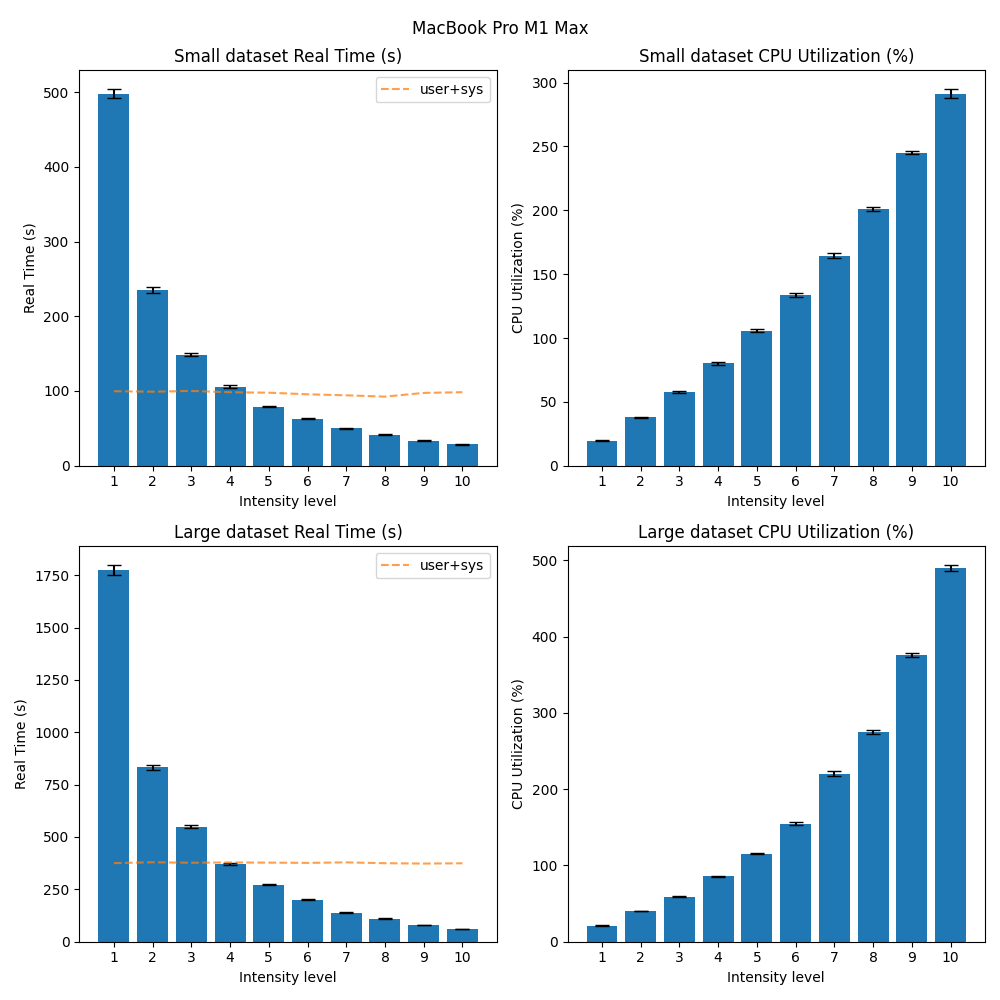
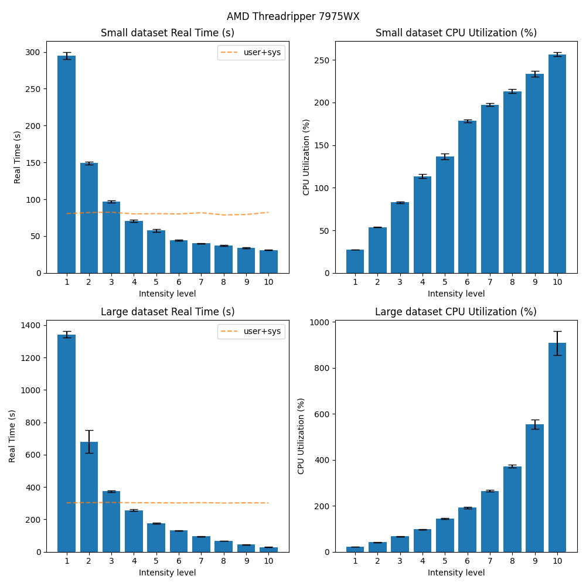
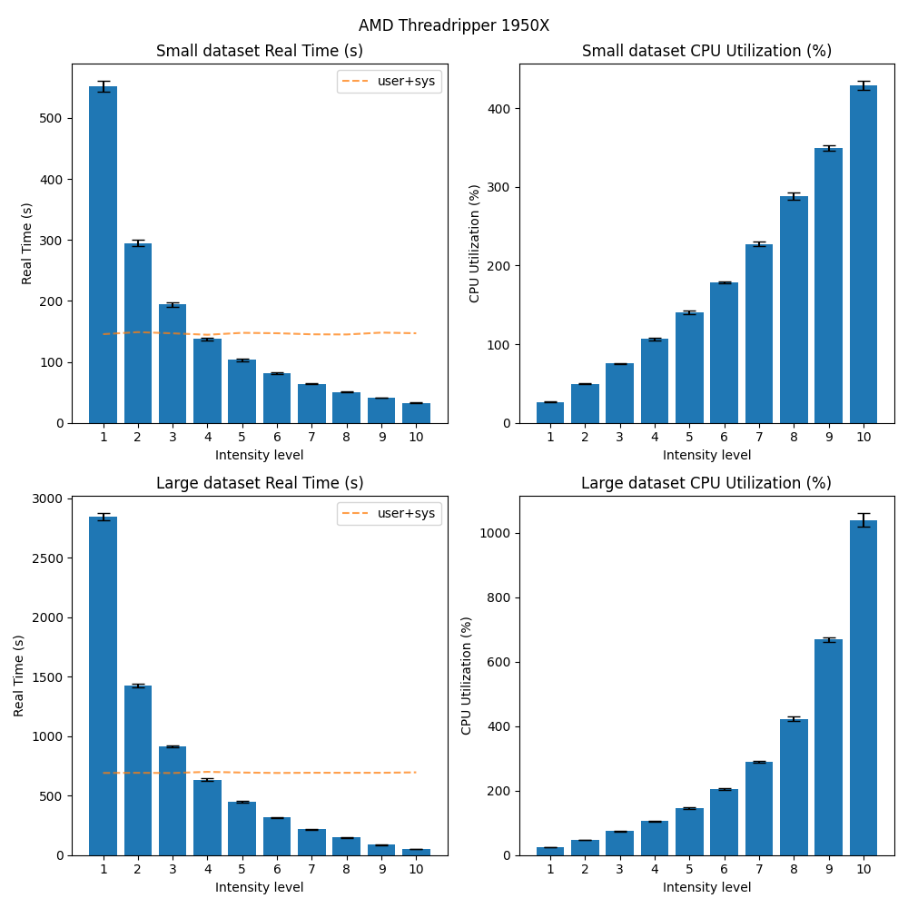
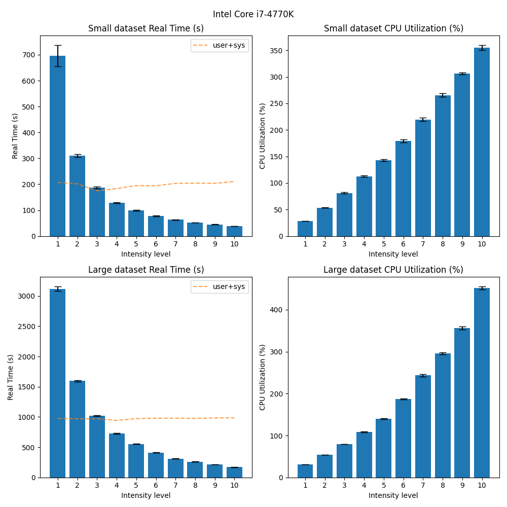

# Feature: taming the CPU utilization of Duplicati during backup.

# Introduction
As Duplicati is meant as a backup program that always runs in the background, it is beneficial to have a way to limit the CPU utilization of the program to limit intrusive impact on the system ([related forum post](https://forum.duplicati.com/t/cpu-load-is-too-high/19015/13), [related issue](https://github.com/duplicati/duplicati/issues/2563)). This blog post outlines the new feature of adding CPU pressure limits to Duplicati. This feature has been merged in pull request [\#5622](https://github.com/duplicati/duplicati/pull/5622) and is available in the [Canary build 2.0.109](https://github.com/duplicati/duplicati/releases/tag/v2.0.9.109_canary_2024-11-06) onwards.

## TL;DR
Inserting sleeps into the `DataBlockProcessor` to limit the CPU utilization is a simple and effective way to limit the CPU utilization of Duplicati during backup operations. This can be controlled using the `--cpu-intensity` parameter, which is a value between 1 and 10, where 10 is no limits and 1 is the most restrictive.

## Machine setup
The following table shows the different machines mentioned:

| Machine | CPU | RAM | OS | .NET |
|---------|-----|-----|----|------|
| MacBook Pro 2021 | (ARM64) M1 Max 10-core (8P+2E) 3.2 GHz | 64 GB LPDDR5-6400 ~400 GB/s | macOS Sonoma 14.6.1 | 8.0.101 |
| AMD 7975WX | (x86_64) 32-core 4.0 GHz (5.3) | 512 GB DDR5-4800 8-channel ~300 GB/s | Ubuntu 24.04 LTS | 8.0.110 |
| AMD 1950X | (x86_64) 16-core 3.4 GHz (4.0) | 128 GB DDR4-3200 4-channel ~200 GB/s | Ubuntu 22.04 LTS | 8.0.110 |
| Intel W5-2445 | (x86_64) 10-core 3.1 GHz (4.6) | 128 GB DDR5-4800 4-channel ~150 GB/s | Ubuntu 22.04 LTS | 8.0.110 |
| Intel i7-4770k | (x86_64) 4-core 3.5 GHz (3.9) | 16 GB DDR3-1600 2-channel ~25 GB/s | Windows 10 x64 | 8.0.403 |
| Raspberry Pi 3 Model B | (ARM64) 4-core 1.2 GHz | 1 GB LPDDR2-900 ~6 GB/s | Raspbian 11 | 8.0.403 |

# Solution
There is no external one-size-fits-all solution to limiting the CPU utilization of a .NET program. The solution must be tailored to the specific program and its architecture. Let us list a few possible solutions:

1. **Inserting sleeps into the pipeline** - Measure how many milliseconds it has run for, and if that is more than what is allowed, sleep for `1000 - allowed` milliseconds. This is a simple and effective way to limit the CPU utilization of the program. The downside is that it is not very precise as there will still be short bursts of high CPU utilization, but it should bring the mean utilization down. This can be either done in a single place, trickling down the pipeline, or in multiple places further reducing the CPU utilization.

2. **Global controller one-way** - A global controller that in a loop sends a 'go ahead', sleep for allowed, then sends a 'stop' signal, and sleeps for the rest of the time. The good thing is that it is a global solution, so it alone can focus on keeping time. The bad thing is the communication overhead, and it doesn't add much more than each process keeping their own time; only reduced time keeping logic at the cost of communication.

3. **Global controller two-way** - A global controller that keeps track of the amount of work done by each process. Every process tries to get a task from this process and responds with the amount of work done. The global controller then calculates how much time each process should sleep. All of the internal channels require buffers, as they now have to run even more asynchronously and the system may deadlock otherwise.

4. **A global lock** - A global lock that is held by the process that is currently working. After acquiring the lock, it checks whether the global time is more than allowed, and if so, sleeps for the rest of the time before performing its operation. If the global time is less than allowed, it performs its operation and releases the lock. This serializes the processes, but should be a very precise way of limiting the CPU utilization. However, CPU utilization can never become above 100% with this approach.

5. **A global lock with a time counter** - The same as 4., but with a time counter that is updated by the time it took to perform the operation. This is a more lightweight solution than 4., but it is also less precise, as processes run in parallel and may collectively exceed the allowed time.

6. **A custom thread pool that suspends all threads** - Each process is spawned in using a custom thread pool that allows for suspending threads. A controller then holds a reference to all of these threads and at a steady interval suspends all threads, sleeps for some time, and then continues all threads. This should alleviate the need to add additional communication and synchronization within the network. However, given that some threads may be in a critical section, suspending them arbitrarily may lead to problems. As such, each process would need to insert "safe-to-suspend" points in their code, leading to the solution being close to the communication approach anyways. It also makes the solution less portable, as there's no standard way to suspend threads in C# across different operating systems.

Considering these approaches, the first one (1.) is the most straightforward and effective way to limit the CPU utilization, as it does not hinder the performance of the program in terms of CPU time spent, but rather spreads it out over time. The other solutions are more complex and thus more error-prone and harder to maintain.

Choosing the insertion point of the sleeps is crucial; we want to place it where most of the CPU time is spent, as reducing the load there will have the most significant effect. The `DataBlockProcessor` performing compression is a good candidate, as it is a CPU-bound operation that is run in parallel. So we'll add a `StopWatch` to keep track of time spent doing actual work, and if it exceeds the allowed time, we'll sleep for one second minus the allowed time. Allowed time is scaled by a new configuration option, `--cpu-intensity`, which is multiplied by 100 ms; e.g. `--cpu-intensity=3` translates to an allowed time of 300 ms, for which a process will sleep for 700 ms, if its execution time exceeds 300 ms. By not including the time spent computing in the equation for time to spend sleeping, we can ensure that the process will actually sleep, even though its execution time exceeds one second.

# Benchmark
To benchmark the effect of this feature, we set up two benchmarks: one with many small files and one with a few large files. The benchmarks were run on the machines mentioned in the table above. Each of them is run with varying `--cpu-intensity` values, ranging from 1 to 10. They are the results of performing 1 warmup run and 10 benchmark runs. To gauge the effects we report two plots: one with the time spent performing the backup and one with the CPU utilization during the backup.

On UNIX systems, we run the `time -p <command>` command to measure the time spent performing the backup. It reports `real` (the wall time in seconds spent), `user` time spent doing work in userspace, and `sys` time spent executing kernel level work. The CPU utilization is then computed from `(user + sys) / real`. On Windows systems, we use the PowerShell command `Measure-Command { <command> }` to measure both the time spent and the CPU utilization. Note that the CPU utilization here can exceed 100% if the program uses more than one core.

The benchmarks can be found [here](https://github.com/carljohnsen/duplicati-blogpost/tree/main/WIP-cputhrottle/benchmark). If we look at the results from running the benchmark on the MacBook:

We see that 1. the time spent performing the backup increases with lower `--cpu-intensity` values, and 2. the CPU utilization decreases with lower `--cpu-intensity` values. This is expected, as the CPU is throttled to spend less time doing work, and more time sleeping. An interesting observation is that the `user+sys` line in the plot remains somewhat constant across intensity values, indicating that the CPU is not spending more time doing work, but rather sleeping, as expected. Interestingly, we also see that as the data size increases, the scaling of the CPU utilization is not as linear. However, there is still a clear distinction between the different intensity values, trending towards the expected behavior.

The same trend can be observed on the other machines and operating systems as well:

# Conclusion
Inserting sleeps into the `DataBlockProcessor` to limit the CPU utilization is a simple and effective way to limit the CPU utilization of Duplicati during backup operations. This can be controlled using the `--cpu-intensity` parameter, which is a value between 1 and 10, where 10 is no limits and 1 is the most restrictive. The benchmarks show that the time spent performing the backup increases with lower `--cpu-intensity` values, and the CPU utilization decreases with lower `--cpu-intensity` values. This is expected, as the CPU is throttled to spend less time doing work, and more time sleeping. The feature is available in the [Canary build 2.0.109](https://github.com/duplicati/duplicati/releases/tag/v2.0.9.109_canary_2024-11-06) onwards.