# Cut restore times by 3.8x: A deep dive into our new restore flow

A crucial property of a backup is its ability to restore your data when you need it, returning files to their original or designated location. But a restore isn't just about getting data back — it’s about getting it back fast. Long restore times can mean downtime, delays, and frustration, making performance a critical factor.

This blog post explores the reworked restore flow, designed to drastically improve speed so you can recover your data faster than ever.

It was originally merged in [PR #5728](https://github.com/duplicati/duplicati/pull/5728), with bugfixes in [PR #5840](https://github.com/duplicati/duplicati/pull/5840), [PR #5842](https://github.com/duplicati/duplicati/pull/5842), [PR #5886](https://github.com/duplicati/duplicati/pull/5886), [PR #5958](https://github.com/duplicati/duplicati/pull/5958), [PR #6026](https://github.com/duplicati/duplicati/pull/6026), [PR #6079](https://github.com/duplicati/duplicati/pull/6079) and with additional optimizations in [PR #5983](https://github.com/duplicati/duplicati/pull/5983), [PR #5991](https://github.com/duplicati/duplicati/pull/5991), [PR #6028](https://github.com/duplicati/duplicati/pull/6028).

It has been included in the canary releases since [Duplicati 2.1.0.103](https://github.com/duplicati/duplicati/releases/tag/v2.1.0.103_canary_2024-12-21) onwards, with the latest version being [Duplicati 2.1.0.112](https://github.com/duplicati/duplicati/releases/tag/v2.1.0.112_canary_2025-03-26), which includes all of the bugfixes and optimizations mentioned above.

The plots generated in this script can be reproduced by running the [benchmark](https://github.com/carljohnsen/duplicati-blogpost/tree/main/25-03-24-5728-restore-rework/benchmark) and the corresponding [plotting notebook](https://github.com/carljohnsen/duplicati-blogpost/tree/main/25-03-24-5728-restore-rework/benchmark/plotting.ipynb), although it will require some modifications to the paths and names in the plotting script.

If any issues arise with the new flow, please report them on the forum. You can still use the legacy flow by supplying the option `--restore-legacy=true`. The legacy flow is also more memory efficient, so if you're running into memory or disk space issues, you can try the legacy flow.

## TL;DR

The restore workflow has been redesigned to leverage concurrent execution, outlined in the following diagram:

This redesign reduces restore time by an average of 3.80x across our benchmarks at the cost of increased memory, disk and CPU utilization. The best observed relative improvement was the medium dataset on an AMD 7975WX, with an average speedup of 8.65x:

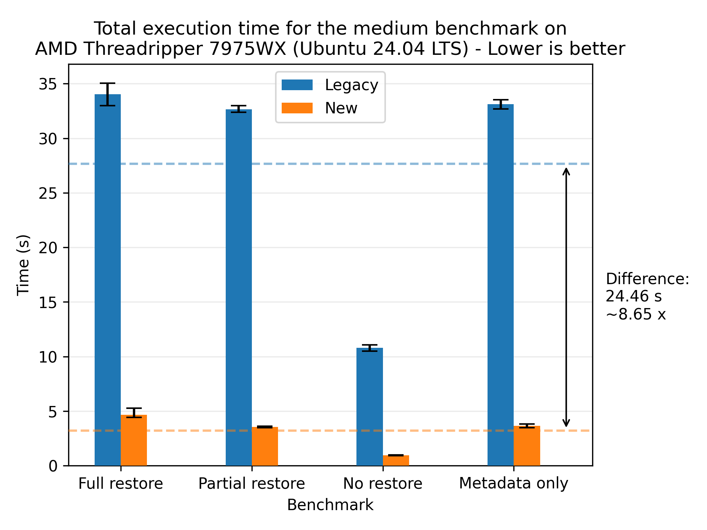

The largest absolute improvement was with the large dataset on the same CPU, with an average reduction of 252.95 seconds (4 minutes and 12.95 seconds):

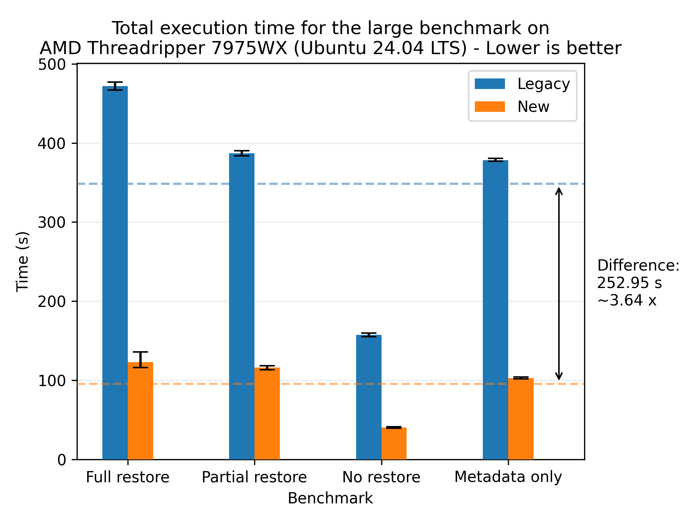

## Machine setup

The following table shows the different machines mentioned:

| Machine          | CPU                                    | RAM                                  | Disk (theoretical peak)                | OS                   | .NET    |
| ---------------- | -------------------------------------- | ------------------------------------ | -------------------------------------- | -------------------- | ------- |
| MacBook Pro 2021 | (ARM64) M1 Max 10-core (8P+2E) 3.2 GHz | 64 GB LPDDR5-6400 ~400 GB/s          | 1 NVMe SSD ~5 GB/s                     | macOS Sequoia 15.3.1 | 8.0.404 |
| AMD 7975WX       | (x86_64) 32-core 4.0 GHz (5.3)         | 512 GB DDR5-4800 8-channel ~300 GB/s | 2 PCIe 5.0 NVMe SSD in Raid 0 ~28 GB/s | Ubuntu 24.04.1 LTS   | 8.0.114 |
| AMD 1950X        | (x86_64) 16-core 3.4 GHz (4.0)         | 128 GB DDR4-3200 4-channel ~200 GB/s | 2 PCIe 3.0 NVMe SSD in Raid 0 ~ 8 GB/s | Ubuntu 22.04.4 LTS   | 8.0.110 |
| Intel W5-2445    | (x86_64) 10-core 3.1 GHz (4.6)         | 128 GB DDR5-4800 4-channel ~150 GB/s | 1 PCIe 4.0 NVMe SSD ~8 GB/s            | Ubuntu 22.04.5 LTS   | 8.0.112 |
| AMD 9800X3D      | (x86_64) 8-core 4.7 GHz (5.2)          | 96 GB DDR5-6400 2-channel ~100 GB/s  | 1 PCIe 5.0 NVMe SSD ~14 GB/s           | Windows 11 x64       | 8.0.403 |

## Terminology

We'll be using the following terms in this post:

- _Block_: A blob of data. A file is made up of one or more blocks.
- _Volume_: A zip file containing one or more blocks.
- _Source file_: The original file that was backed up.
- _Target file_: The target file that is being restored. It may be the same path as source, depending on the `--restore-path` parameter.
- _File filter_: The filter that is used to select which files to restore. For example, for a full restore, the filter would be `"*"`.
- _Local_: The machine that is performing the restore. It may be the same machine as the backup was performed on, but it doesn't have to be.
- _Remote_: The provider storing the backup. E.g. Amazon S3, local file, an SSH server, etc. In the benchmarks in this blog post, the remote storage is local storage.
- _Local database_: The database that keeps track of which files a backup contains, which blocks make up each file, and in which volumes the blocks are stored.
- _Flow_: A sequence of processing steps that are performed in a specific order. A flow can be sequential, parallel, or a combination of both.
- _Legacy flow_: The restore flow that has been in use for many years.
- _New flow_: The restore flow that has been rewritten to be parallelized and is the subject of this blog post.
- _[Communicating Sequential Processes (CSP)](https://www.cs.cmu.edu/~crary/819-f09/Hoare78.pdf)_: A programming paradigm that models concurrent systems as a network of independent processes that communicate through channels. In Duplicati, the CSP library [CoCoL](https://github.com/kenkendk/cocol) is used, but in principle any CSP library could be used. It was chosen since it is already being used in Duplicati, especially in the backup flow.
- _Process_: A CSP process that sequentially performs a specific task, only sharing data through channels. A process can be a thread, a coroutine, or any other form of concurrent execution.
- _Channel_: A CSP channel that is used to communicate between processes. A message can be any object. A channel can be unbuffered, meaning a synchronous/rendezvous channel where the sender and receiver must be ready to communicate, or buffered, meaning an asynchronous channel where the sender can send a message without the receiver being ready to receive it up to a certain buffer size. In the benchmarks in this blog post, the channels are buffered.
- _Patching_: The process of updating a file with new data. In the context of Duplicati, it is the process of writing blocks from the remote storage to the designated location in the target file.
- _Hashing_: The process of computing a fixed-size hash value from a variable-size input. In the context of Duplicati, it is used as a fingerprint to verify that the data has not been corrupted during.

# The old restore flow

Before describing the new flow, there's value in understanding the old restore flow, its strengths and weaknesses. The following description describes all of the steps, some of which may be skippped depending on the supplied options. The legacy restore flow is as follows:

1. Combine file filters to find the files that needs to be restored.
2. Open or restore the local database keeping track of the backup.
3. Verify the remote files;
   1. Get the list of remote volumes.
   2. Verify that there are no missing or unexpected extra volumes.
4. Prepare the list of files to restore the list of blocks each file needs.
5. Create the target directory structure.
6. Scan the existing target files for existing blocks, as they don't need to be restored.
7. Scan for existing source files for existing blocks, as they can be copied to the target file.
8. Patch target files with the local blocks found in step 7.
9. Get the list of required volumes to download based of the blocks that are still missing locally.
10. For each volume:
    1. Download the volume.
    2. Decrypt the volume.
    3. Decompress the volume.
    4. For each block in the decompressed volume:
       1. Extract the block from the volume.
       2. Check that the size and block hash matches what's recorded in the database to ensure that the block hasn't been corrupted.
       3. Patch all of the target files that need this block.
11. Restore metadata; for each target file:
    1. Download the volume(s) that contains the metadata.
    2. Decrypt the volume(s).
    3. Decompress the volume(s).
    4. Extract the metadata block(s) from the volume(s).
    5. Check that the size and block hash of each block matches what's recorded in the database to ensure that the block hasn't been corrupted.
    6. Restore the metadata from the block(s).
12. Verify the restored files; for each target file:
    1. Read the target file.
    2. Compute the hash of the target file.
    3. Check that the hash and size matches to ensure that the file has been restored to the state recorded during the backup.

The flow is visualized in the following diagram:

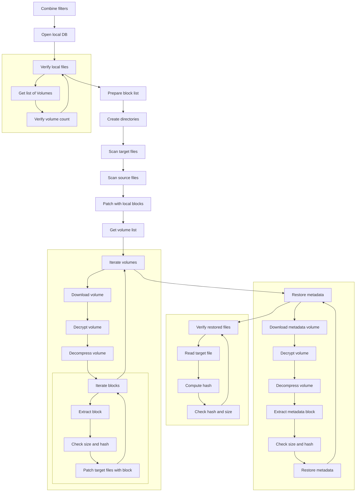

This flow has several benefits:

- There is a clear separation of the different steps.
- Volumes are only downloaded once.
- Blocks are only extracted once.
- The flow has a low memory and disk footprint.
- The flow is stable, as it has been in use for many years.

It has the following drawbacks:

- The separation of steps can lead to multiple passes over the same data, moving in and out of memory and disk.
- Each step is sequential, thus not fully utilizing system resources or leveraging overlapping execution. This results in the flow potentially being very slow.
- Block writes are scattered across disk, leading to potentially slow writes, as disks favor sequential access patterns.

# The new restore flow

The new restore flow tackles the problems of the legacy restore flow while retaining as many of its benefits as possible.

## Scattered block writes

Instead of minimizing the number of remote downloads, we shift from a volume-centered to a file-centered approach. This shift results in blocks being written sequentially to disk for each file, which is a more disk-friendly access pattern. The major problem with this approach is that each file does not track how deduplicated blocks are shared between files. As such, multiple files would download the same volume multiple times, alongside decryption and decompression; a lot of redundant work.

To solve this, we introduce a new caching system that keeps track of which blocks are needed for each file and ensures that each block is only downloaded, decrypted, and decompressed once. The caching system is split into two parts: a volume cache and a block cache. The volume cache keeps track of which volumes are needed for each file and ensures that each volume is only downloaded once. It is decrypted and stored on disk in a temporary folder, until it is no longer needed at which point it is deleted. The block cache keeps track of how many times a block is needed throughout the restoration flow, and ensures that each block is only decompressed once. If it is needed more than once, it is stored in a dictionary in memory, until it is no longer needed at which point it is deleted.

While the reads from the remote storage are still scattered, they don't (usually) suffer as much, given that the dblock size is many times larger than the block size of a backup. Furthermore, the extraction of blocks from the volumes are performed in memory where random access is much faster.

The only problem that this approach introduces is that the caching system needs to be managed, which can be a complex task. For systems with limited memory and disk space, we provide tunable parameters to control the size of the caches. This allows the user to balance speed and resource usage. If the volume cache is small, the system will download volumes multiple times. For setups with a high-speed remote connection, this trade-off may be beneficial. If the block cache is small, the system will decompress blocks multiple times. For setups with limited memory, this may be a good trade-off, since the restore operation is still able to complete, albeit slower than with the caches fully utilized.

However, these caches are only really utilized when there's high deduplication between files, so the caches shouldn't grow too large.

Future work will analyze block and volume deduplication across files to optimize cache utilization and maximize data reuse. The worst case can occur when the order of files is such that the caches don't get auto evicted and the system runs out of memory or disk space. The aforementioned future work would alleviate this problem. However, our tests showed that this was rarely an issue, but that may be due to the test machines having a large amount of system memory.

## Parallelization and overlapping execution

To fully utilize the system resources, we parallelize the restore flow and allow for overlapping execution of the different steps. This is done by reworking the core steps 4 onwards. In particular, most of the time spent in the legacy flow is step 10 (downloading, decrypting, decompressing, and patching blocks) and step 12 (verifying the restored files).

The new flow is as follows:

1. Combine file filters to find the files that needs to be restored.
2. Open or restore the local database keeping track of the backup.
3. Verify the remote files;
   1. Get the list of remote volumes.
   2. Verify that there are no missing or unexpected extra volumes.
4. Start the network of concurrent processes.
   1. The `FileLister` process lists the files that need to be restored.
   2. The `FileProcessor` will restore the files.
      1. Receive a filename
      2. Figure out which blocks are needed for the file.
      3. Check how many blocks the target file already has, as they don't need to be restored.
      4. Check how many blocks the source file has, as they can be copied directly.
      5. Request the missing blocks. The blocks are requested in a burst to increase throughput as the network is more likely to be kept busy with requests.
      6. Patch the target file with the blocks received blocks.
      7. Verify that the target file matches the expected size and hash.
      8. Request the metadata blocks.
      9. Verify that the metadata blocks match the expected size and hash.
      10. Restore the metadata.
   3. The `BlockManager` will respond to block requests, caching the blocks extracted from volumes in memory. It starts by computing which blocks and volumes are needed during the restore and how many times each block is needed from each volume. This is used to automatically evict cache entries when they are no longer needed to keep the footprint of the cache low.
      1. If the requested block is in the cache (in memory), it will respond with the block from the cache.
      2. If the requested block is not in the cache (in memory), it will request the block from the `VolumeManager`. When receiving the block from the volume cache, it will notify all of the pending block requests. If the number of pending requests is lower than the number of times the block is needed, it will store the block in the cache. Otherwise, the block will be discarded. It will also notify the `VolumeManager` when the volume can be evicted from its cache.
   4. The `VolumeManager` will respond to volume requests, caching the volumes on disk. The `BlockManager` is keeping count of the number of times each block is needed and will notify the `VolumeManager` when a volume can be evicted from the cache.
      1. If the volume is in the cache (on disk), it will request the block to be extracted from the volume.
      2. If the volume is not in the cache (on disk), it will request the volume to be downloaded. Once the volume is downloaded, it will request the block to be extracted from the volume.
   5. The `VolumeDownloader` will download the volume.
      1. Receive a volume request.
      2. Download the volume.
      3. Send the downloaded volume to the volume decryptor.
   6. The `VolumeDecryptor` will decrypt the volume.
      1. Receive a volume.
      2. Decrypt the volume.
      3. Send the decrypted volume to the volume cache.
   7. The `VolumeDecompressor` will decompress the volume.
      1. Receive a volume.
      2. Extract the block from the volume.
      3. Verify that the block matches the expected size and hash.
      4. Send the extracted block to the block cache.

The flow is visualized in the following diagram. Each number on the arrows represents the order of the messages sent between the processes for a single request:

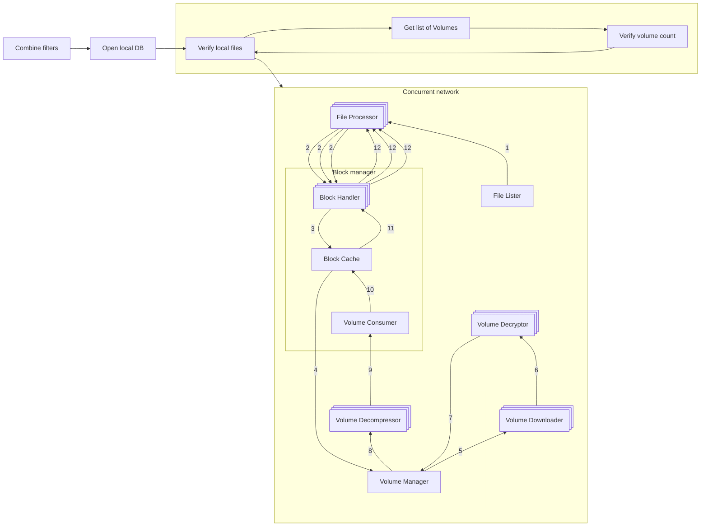

The implementation of each process in the process network can be seen in the respectively named files in the [`Duplicati/Library/Main/Operation/Restore` folder](https://github.com/duplicati/duplicati/tree/master/Duplicati/Library/Main/Operation/Restore).

With this setup, the processes in step 4 can run asynchronously, allowing for overlapping execution. Furthermore, some of the processes can run in parallel, allowing for using more system resources at the bottleneck steps. In particular, the core work of downloading (4.5 Volume Downloader), decrypting (4.6 Volume Decryptor), decompressing (4.7 Volume Decompresor), and patching blocks (4.1 File Processor) is parallelized. Each of these steps can be scaled individually to maximize the utilization of the system resources.

A major benefit is the removal of the post verification step, as verification is now performed on the fly during the restore flow. This was separated in the legacy flow as the block writes were scattered, meaning each file was not ensured fully restored until the end of the flow. In the new flow, each File Processor knows exactly when each file is fully restored and can thus verify while it is being restored.

The entire network shuts down in sequence, beginning with the File Lister, once it runs out of files to request. Then each File Processor shuts down when trying to request a file from the File Lister, which is no longer available. Once all File Processors have shut down, the Block Manager signals the Volume Manager to shut down, which in turn shuts down the Volume Downloaders, Volume Decryptors, and Volume Decompressors. Once that subnetwork has shut down, the Block Manager follows as the final process to terminate.

This new flow alleviates the problems of the legacy flow, while retaining most of its benefits:

- While the steps are no longer performed in a clear sequence, each step is still encapsulated in a distinct process, maintaining a clear separation of concerns.
- The steps are executed concurrently, allowing for overlapping execution and better utilization of system resources.
- The block writes are sequential to a file, leading to a more disk-friendly access pattern per file written.
- The caching system ensures that each block and volume is only downloaded, decrypted, and decompressed once (assuming that cache entries aren't evicted too early due to memory limitations).
- Verification is now performed as part of the restore flow.

It has the following drawbacks:

- The new flow is more complex as it consists of a network of processes communicating through channels. This can, in the worst case, lead to deadlocks where the system is stalled without any progression. However, we have added timeout detection to warn the user if the system stalls. We have also tried to ensure that any error will terminate the network, so the system will not be stuck indefinitely.
- The caching system needs to be managed, which can be a complex task, and that entails increased resource consumption. However, in our testing, most of the work spent was not managing cache, but actual work; downloading, decrypting, decompressing, and patching blocks.
- The flow is less stable, as it is a new implementation that hasn't been tested as thoroughly as the legacy flow. Given more time and use, confidence in the new flow will increase.

## Additional optimizations

In addition to the new flow, we've added several optimizations to the restore flow:

- **Preallocation**: The target files can be preallocated, hinting the size to the filesystem. This can benefit the restore speed on some systems, as it hints the size to the filesystem, potentially allowing for more efficient file allocation (e.g. less fragmentation).
- **Parallel downloads**: The BackendManager now supports parallel downloads, allowing for multiple volumes to be downloaded at the same time. This can increase the throughput of the restore operation, especially on high-speed connections. In the benchmarks of this post, the backend was a local filesystem, so this optimization really sped up the restore operation.
- **Parallel database connections**: Regarding the backup database, the restore operation is non-intrusive, as it only involves reading from the database. As such, we can open multiple connections to the database, allowing for faster access to the database.
- **Memory pool**: The memory pool is a shared allocation system that is used to allocate memory for the blocks. Rather than using a new memory allocation for each block, the memory pool is used to allocate memory for the blocks, which is returned after use. This reduces garbage collection overhead caused by many small memory allocations.

## Tunable parameters

This new flow introduces several tunable parameters to control parallelism, the size of the caches, and toggling the legacy flow:

### Cache

- `--restore-cache-max=4gb`: The size (in bytes) of the block cache. The default is 4 GiB. If the cache is full, the cache will be compacted according to the strategy of [MemoryCache](https://learn.microsoft.com/en-us/dotnet/api/microsoft.extensions.caching.memory.memorycache).
- `--restory-cache-evict=50`: The percentage of the block cache that will be evicted when the cache is full. The default is 50%.

### Parallelism

- `--restore-file-processors=n_cores/2`: The number of file processors to run in parallel. The default is half the number of cores available on the machine.
- `--restore-volume-decompressors=n_cores/2`: The number of volume decompressors to run in parallel. The default is half the number of cores available on the machine.
- `--restore-volume-decryptors=n_cores/2`: The number of volume decryptors to run in parallel. The default is half the number of cores available on the machine.
- `--restore-volume-downloaders=n_cores/2`: The number of volume downloaders to run in parallel. The default is half the number of cores available on the machine.
- `--restore-channel-buffer-size=n_cores`: The size of the channel buffer. The default is the number of cores available on the machine. This can be increased to allow for more messages to be in flight, potentially increasing the throughput of the restore operation at the cost of increased memory usage.

### General

- `--restore-legacy=false`: Toggles whether to use the legacy restore flow. The default is false, enabling the new restore flow.
- `--restore-preallocate-size=false`: Toggles whether to preallocate the target files. The default is false, not preallocating the target files. This can benefit the restore speed on some systems, as it hints the size to the filesystem, potentially allowing for more efficient file allocation (e.g. less fragmentation).
- `--internal-profiling=false`: Toggles whether keep internal timers of each part of the restore flow. The default is false, not keeping internal timers. This is useful for tuning the parallelism parameters as the bottleneck processes can be identified.

# Results

The new restore flow has been tested on the machines outlined in the Machine setup section. We perform the following tests:

- **Full restore** - The target directory of the restore is empty.
- **Partial restore** - The target directory contains 50 % of untouched files, 25 % of files are missing, and 25 % of files have a single modified block.
- **No restore** - The target directory contains all of the files in their expected state. Metadata is skipped, so this test should not be fetching from remote storage.
- **Restore metadata** - The target directory contains all of the files, but each file has an incorrect timestamp, leading to only the metadata being restored.

Each test will be performed with the new flow and the legacy flow, with 10 measured runs. For each configuration, the best and worst times are discarded and the reported times are plotted with error bars. The benchmarks are (unless specified otherwise) performed on local storage, as we're focusing on the execution of the restore process. For Windows we've disabled Windows Defender real-time protection as this does not go well with a disk-stressing benchmark. We'll be using three datasets:

| Dataset        |     Files |   Size | Max file size | Duplication rate |
| -------------- | --------: | -----: | ------------: | ---------------: |
| Small dataset  |     1,000 |   1 GB |         10 MB |              20% |
| Medium dataset |    10,000 |  10 GB |        100 MB |              30% |
| Large dataset  | 1,000,000 | 100 GB |        100 MB |              40% |

'Files' is the target number of files, 'Size' is the target size, and 'Max file size' is the maximum file size a single file can have. Each of these values is a target, meaning they are approximate. They will however be deterministic across the runs and machines, as they're using the same seed during generation. Duplication rate is the percentage of blocks that already exist in another file. This is implemented by having the files being filled with 0s.

## General results

We'll start by presenting the general results of the new restore flow compared to the legacy restore flow. Let's look at the results for the small dataset on the MacBook:

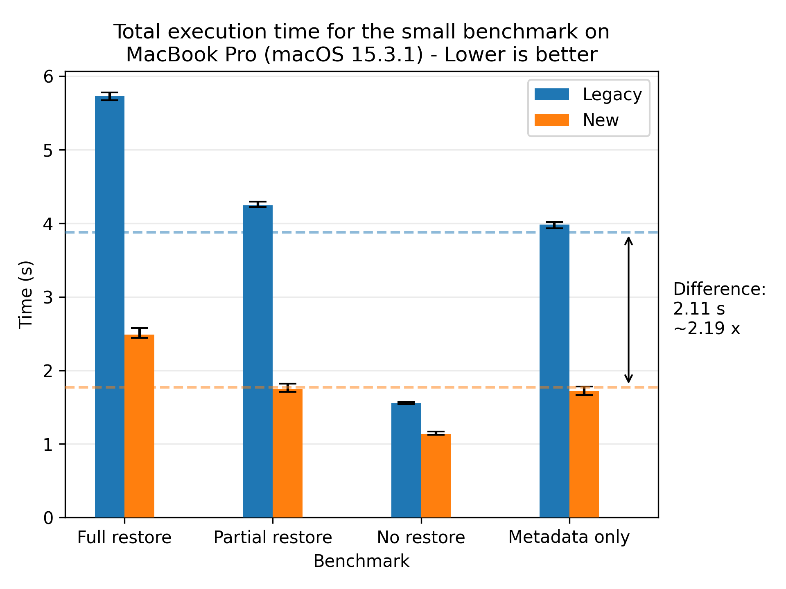

Here we see a significant speedup for the new restore flow compared to the legacy restore flow, yielding a speedup of 2.19x on average. The error bars show the fastest and slowest runs, which are quite close to the average. This indicates that the new restore flow is stable and performs consistently across runs.

If we look at a profiled run of the legacy flow, we see that `3641 + 1541 + 839 = 6021 ms` of the time is spent on restore, metadata and verification, compared to the total 7408 ms. This means that ~83 percent of the workload is parallelizable. If we apply Armdahl's law:

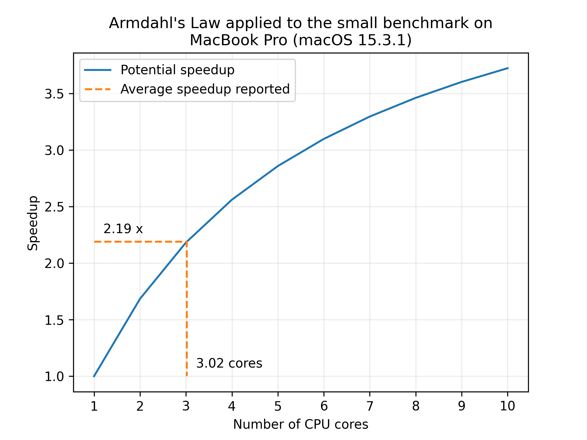

We see that a speedup of 2.19 suggests that 3 cores are being utilized. This is not quite as far as we'd like, but that was assuming that the entire workload was parallelizable. In practice, there are some sequential parts of the workload, such as the network and disk I/O, that are not parallelizable, so this rough estimate of the speedup is seemingly quite good.

Let's look at the results for the medium dataset:

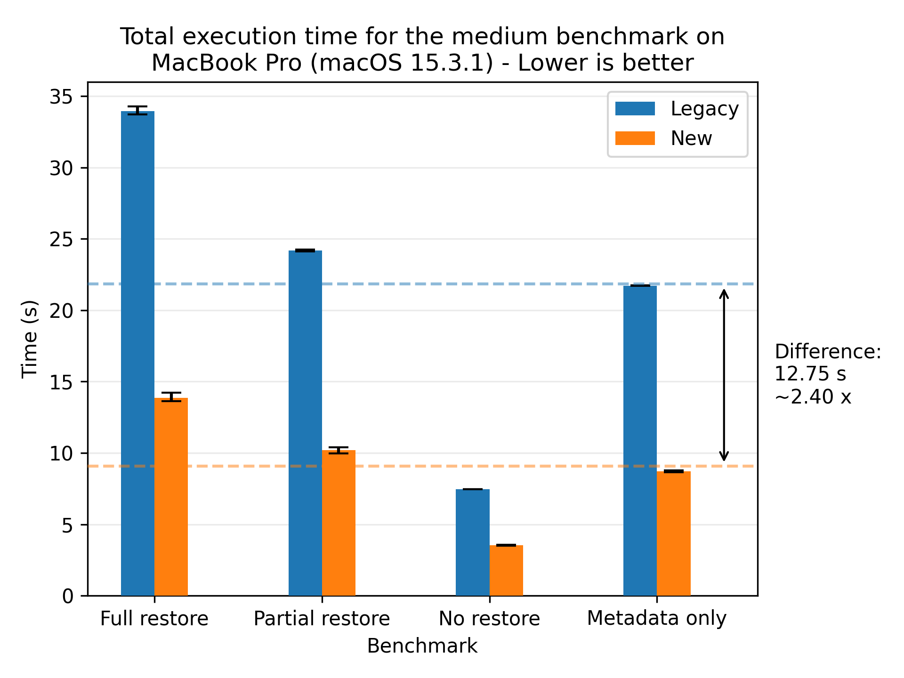

Here we see the speedup becoming more pronounced, with a speedup of 2.40x on average. The error bars are even tighter than for the small dataset.

Let's look at the results for the large dataset:

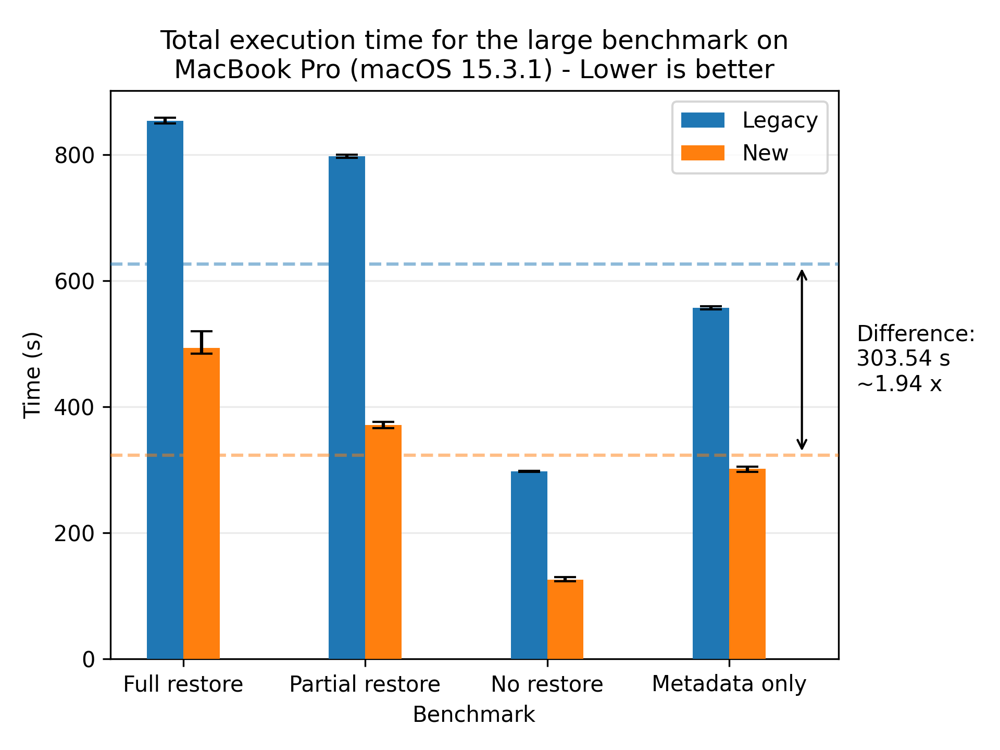

Where we see a speedup of 1.94x on average. For completeness, we also show the plots for all of the other machines, where the most performant run was the AMD 7975WX on the medium dataset with a speedup of 8.65x on average:

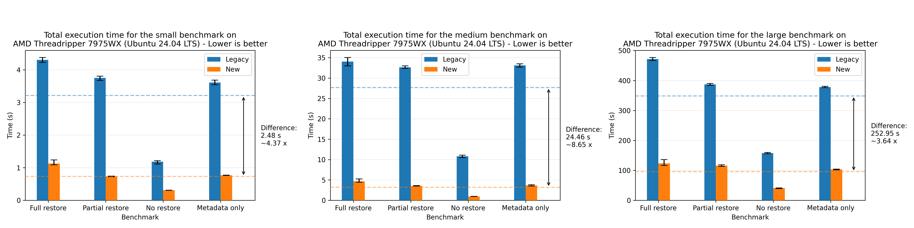

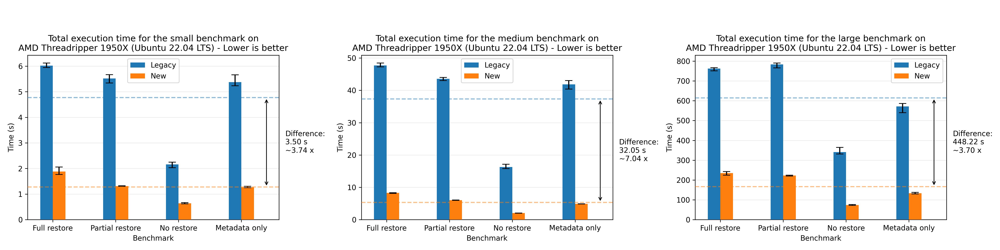

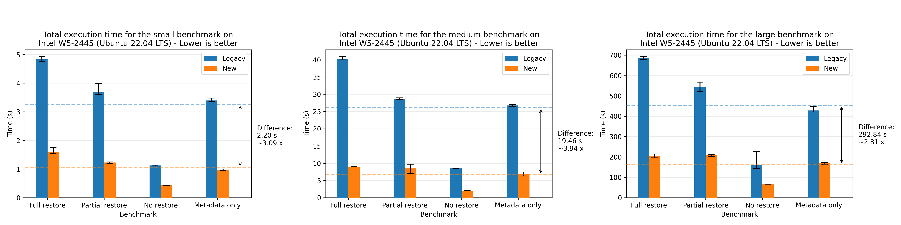

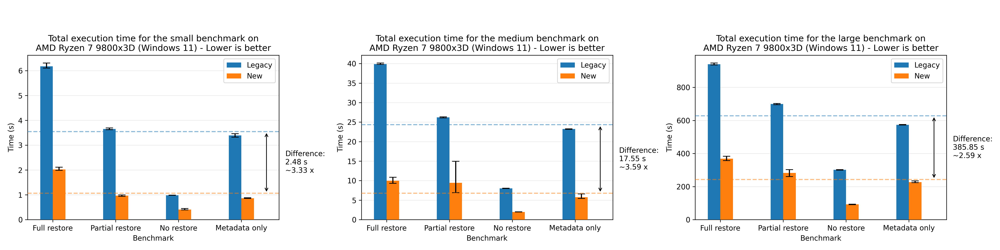

There's a small discrepancy in the performance numbers from the Windows machine, which we are yet to investigate. The performance numbers are still within the expected range when comparing relatively to the legacy flow, so we're not too concerned about it.

## Effects of the sparsity of the data

One strength of the legacy approach is that it downloads each volume only once, then extracts blocks and patches the corresponding target files. This allows for quite efficient use of the extracted blocks, leading to high deduplication and improved performance. The new approach tries to leverage the same deduplication through the block and volume caches, so let us look at the effect of the deduplication rate on the performance of the two restore flows:

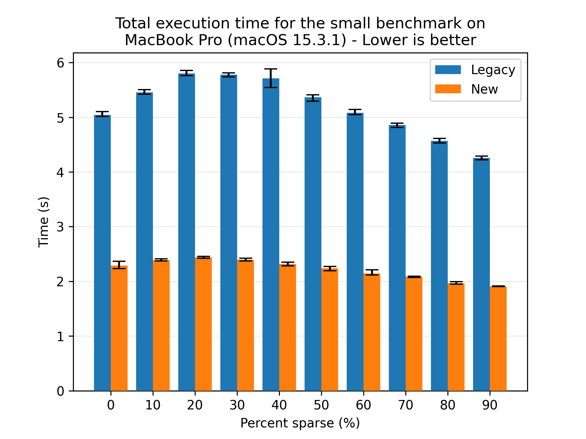

Here we see that both flows benefit from higher deduplication rates, and the new flow is consistently faster than the legacy flow. Looking at the absolute numbers, the new flow is seemingly less affected by the deduplication rate, as the variance in performance is lower than for the legacy flow. However, to be sure, we look at the normalized times, where each flow is scaled to their respective best time:

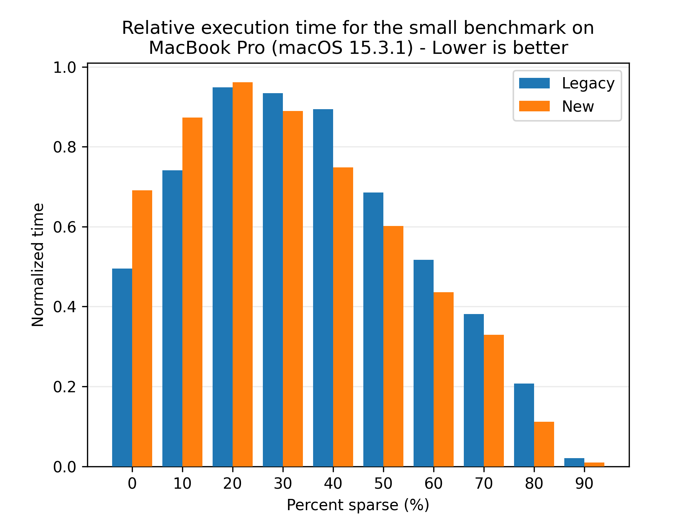

This plot shows that both flows follows the same trend, so we can conclude that the caching system allows for the new flow to also leverage the deduplication rate.

## Effects of multiple FileProcessors on HDDs

The new restore flow focuses on sequential writes to disk, which is beneficial for HDDs, especially compared to the legacy restore flow, which scatter the block writes across the disk. To see the effect of this, we scale the number of FileProcessors on the 9800X3D, which has two additional 3 TB HDDs. We'll be backing up to one disk and restoring to the other disk. We'll be using the medium dataset for this test:

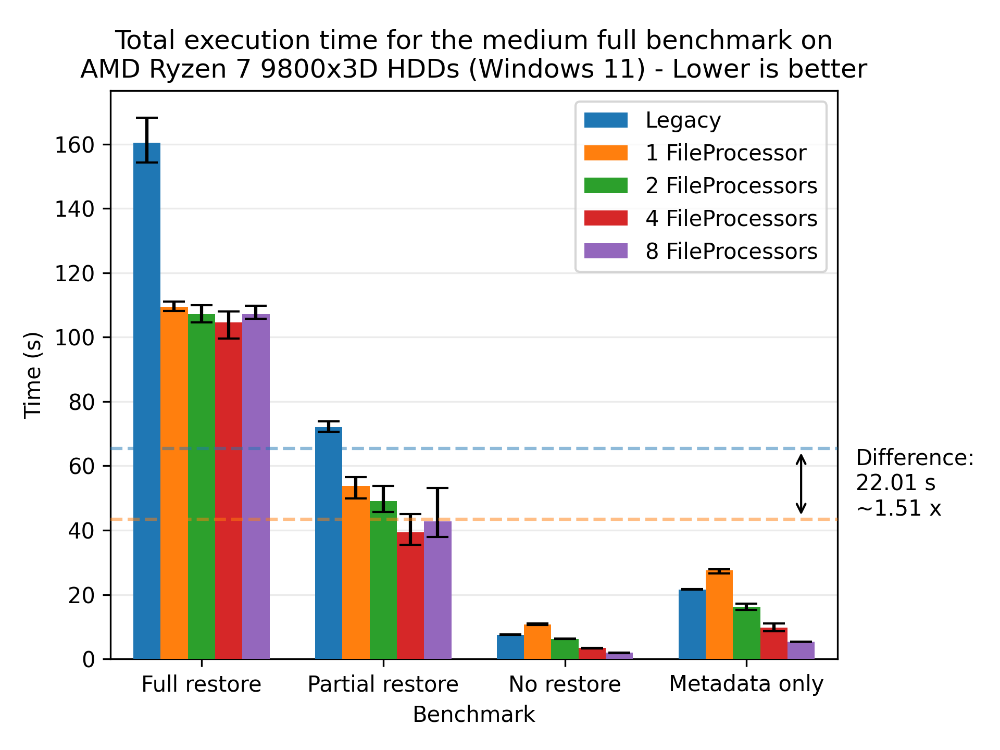

Here we see that the new restore flow is faster than the legacy restore flow, with a speedup of 1.51x on average even though both flows are able to keep the target disk at almost 100% utilization. This means that the added parallelism of the new restore flow is negligible as both are limited by the disk speed. We still observe a performance gain, which is due to the on-the-fly verification of files, which eliminates the need for an additional pass over the data.

There is still some merit in running multiple FileProcessors, as the new restore flow reaches the saturation point at 4 FileProcessors. The disk reaches saturation at around 4 FileProcessors, where the latency of the disk results in diminishing returns. The benefits become more pronounced as the load to disk decreases, which we can see in the "no restore" benchmark.

## Preallocation on HDDs

Preallocation hints the size of the target files to the filesystem, potentially allowing for more efficient file allocation (e.g. less fragmentation). This is particularly beneficial for HDDs, which are prone to fragmentation. To see the effect of this, we'll be running the medium dataset on the 9800X3D with and without preallocation:

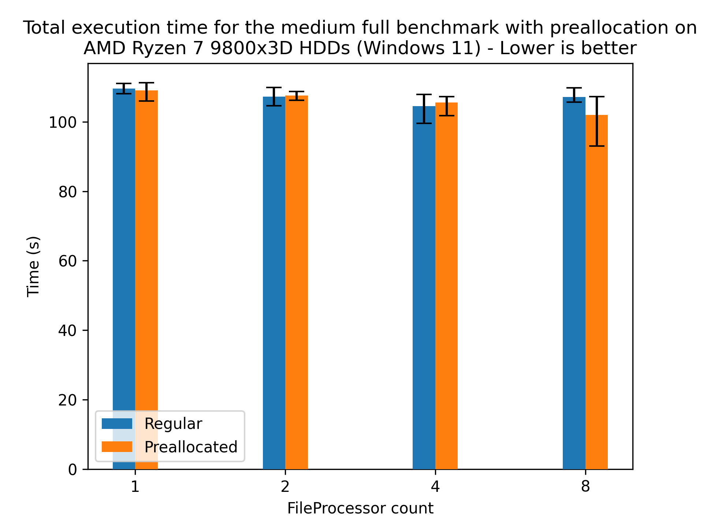

Here we see a slight speedup for 8 FileProcessors, which doesn't really confirm the hypothesis, as the speedup is within the margin of error. However, preallocation provides a size hint to the filesystem, which can benefit its long-term health. Furthermore, this effect is likely due to the fact that the target disk is quite new and unused, so fragmentation is not as big of an issue as it would be on a disk that has been used for a while. Regardless, providing the hint doesn't hurt the performance, so enabling it for HDD based systems is recommended.

# Future work

## Automatic tuning of parameters

The default parameters for the new restore flow works reasonably well for most setups, but there is still room for improvement. Our own lightweight testing shows that there's about an extra 10 % of performance to gain by tuning the parameters. However, the parameters aren't widely applicable across different setups, and the current process is quite manual. Future work will have a tool that'll automatically tune the parameters for the user's setup, by running a few test restores and adjusting the parameters based on the results.

## Direct storage access

While the new restore flow is faster, we're still not achieving the maximum throughput of the storage. One reason could be that the storage is being cached by the operating system, leading to suboptimal performance because the data is not being used frequently enough to reap the benefits of the cache. The data written to the target file is no longer needed, so there's no reason to keep it in the cache. Once the data is written to the target file, it's no longer needed in the cache. The same applies to volumes, where only the final decrypted volume is accessed multiple times. For SATA drives and the like, the speeds are so low that the cache is not a bottleneck, but for high-speed NVMe drives, the cache can be a bottleneck.

To alleviate this, we could use direct storage access (`O_DIRECT` on NIX systems and `FILE_FLAG_NO_BUFFERING` on Windows systems), bypassing the operating system cache. Previous projects indicate that direct storage access is necessary to achieve maximum throughput. It's a non-trivial task, as it requires the data to be aligned correctly and the sizes to be multiples of the block size of the storage, which is why it's being left for future work.

## Smart ordering of files to restore

As outlined "Scattered block writes", the order of the files could be arranged to maximize the cache utilization while minimizing the time a block and/or volume is kept in the cache. This would require a more in-depth analysis of the deduplication across files, which is left for future work. The current strategy is to restore larger files first, as they're more likely to share blocks with other files, but this is a heuristic and not a guarantee.

## Deeper investigation of the Windows performance

The performance of the Windows machine is slightly lower (in absolute numbers) compared to the other machines. This is strange because the CPU is quite powerful and the storage is fast. This may be attributed to the lack of direct storage access, but at the time of writing we're unsure of the exact cause.

# Conclusion

In this blog post, we've presented the new restore flow - a complete rework of the legacy flow, designed to leverage concurrent execution and drastically reduce restore times.

Across all benchmarks, the new flow has shown an average 3.80x speedup, utilizing system resources more aggressively to optimize memory, disk, and CPU usage. With tunable parameters, you can balance performance and resource consumption to suit your needs.

Less waiting. More restoring. Whether you're recovering a single file or an entire backup, the new restore flow is built for speed. Download and install [the latest canary build](https://github.com/duplicati/duplicati/releases/tag/v2.1.0.112_canary_2025-03-26) to experience the difference for yourself!
