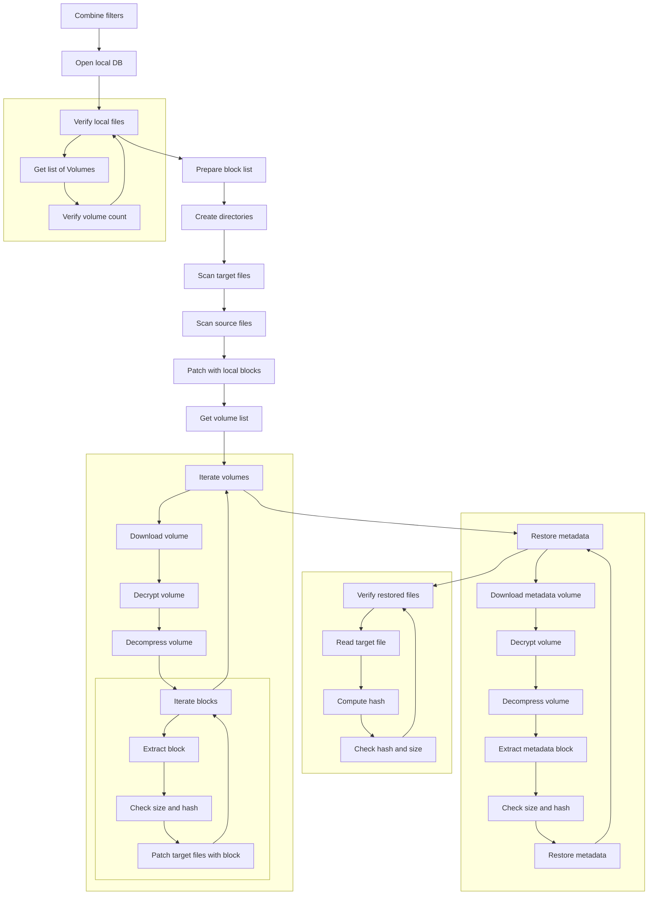
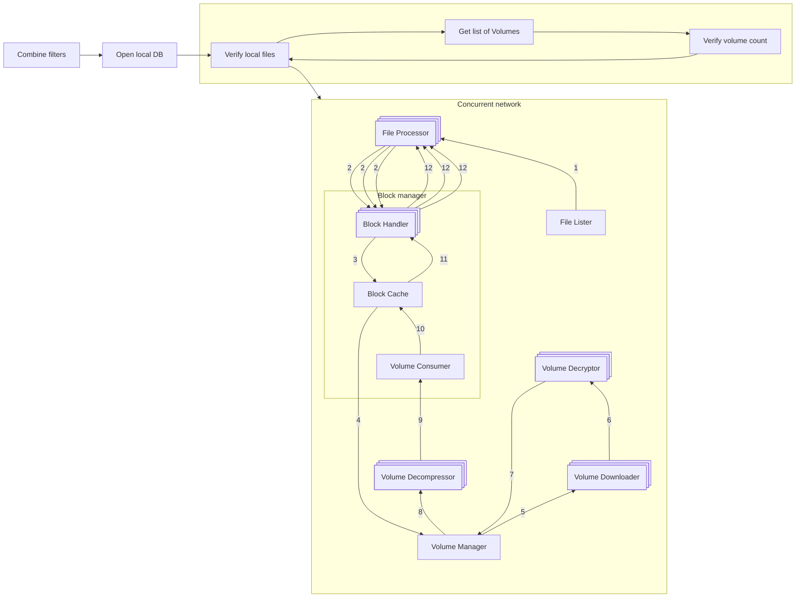

# Speeding up the restore operation

We start by backing up pre-sc-ad to a local folder, as this should remove the upload/download overhead.

This blog post describes the reworked restore flow.

It has been merged in [PR #5728](https://github.com/duplicati/duplicati/pull/5728).

It has been part of the releases since [Duplicati 2.1.0.103](https://github.com/duplicati/duplicati/releases/tag/v2.1.0.103_canary_2024-12-21) onwards.

If any issues arise with the new flow, please report them here on the forum and the legacy flow can still be used instead by supplying the option `--restore-legacy=true`.

## TL:DR;

The legacy restore flow is slow because it is performed sequentially. The restore flow is rewritten to leverage concurrent execution, reducing the restore time by X times on average at the cost of increased memory, disk and CPU utilization. The new flow can be tuned to balance the resource usage and the restore time.

- Graph showing the new process network
- Some graph showing the time reduction

## Machine setup

The following table shows the different machines mentioned:

| Machine                | CPU                                    | RAM                                  | OS                 | .NET    |
| ---------------------- | -------------------------------------- | ------------------------------------ | ------------------ | ------- |
| MacBook Pro 2021       | (ARM64) M1 Max 10-core (8P+2E) 3.2 GHz | 64 GB LPDDR5-6400 ~400 GB/s          | macOS Sequoia 15.2 | 8.0.404 |
| AMD 7975WX             | (x86_64) 32-core 4.0 GHz (5.3)         | 512 GB DDR5-4800 8-channel ~300 GB/s | Ubuntu 24.04.1 LTS | 8.0.112 |
| AMD 1950X              | (x86_64) 16-core 3.4 GHz (4.0)         | 128 GB DDR4-3200 4-channel ~200 GB/s | Ubuntu 22.04.4 LTS | 8.0.110 |
| Intel W5-2445          | (x86_64) 10-core 3.1 GHz (4.6)         | 128 GB DDR5-4800 4-channel ~150 GB/s | Ubuntu 22.04.5 LTS | 8.0.112 |
| AMD 9800X3D            | (x86_64) 8-core 4.7 GHz (5.2)          | 96 GB DDR5-6400 2-channel ~100 GB/s  | Windows 11 x64     | 8.0.403 |
| Raspberry Pi 3 Model B | (ARM64) 4-core 1.2 GHz                 | 1 GB LPDDR2-900 ~6 GB/s              | Raspbian 11        | 8.0.403 |

## Termonology

We'll be using the following terms in this post:

- _Block_: A blob of data. A file is made up of one or more blocks.
- _Volume_: A zip file containing one or more blocks.
- _Source file_: The original file that was backed up.
- _Target file_: The target file that is being restored. It may be the same path as source, depending on the `--restore-path` parameter.
- _File filter_: The filter that is used to select which files to restore. E.g. for a full restore, the filter would be `"*"`.
- _Local_: The machine that is performing the restore. It may be the same machine as the backup was performed on, but it doesn't have to be.
- _Remote_: The provider storing the backup. E.g. Amazon S3, local file, an SSH server, ...
- _Local database_: The database that keeps track of which files a backup contains, which blocks make up each file, and in which volumes the blocks are stored.
- _Flow_: A sequence of processing steps that are performed in a specific order. A flow can be sequential, parallel, or a combination of both.
- _Legacy flow_: The restore flow that has been in use for many years.
- _New flow_: The restore flow that has been rewritten to be parallelized and is the subject of this blog post.
- _[Communicating Sequential Processes (CSP)](https://www.cs.cmu.edu/~crary/819-f09/Hoare78.pdf)_: A programming paradigm that models concurrent systems as a network of independent processes that communicate through channels. In Duplicati, the CSP library [CoCoL](https://github.com/kenkendk/cocol) is used, but in principle any CSP library could be used. It was chosen since it is already being used in Duplicati, especially in the backup flow.
- _Process_: A CSP process that sequentially performs a specific task, only sharing data through channels. A process can be a thread, a coroutine, or any other form of concurrent execution.
- _Channel_: A CSP channel that is used to communicate between processes. A message can be any object. A channel can be unbuffered, meaning a synchronous/rendezvous channel where the sender and receiver must be ready to communicate, or buffered, meaning an asynchronous channel where the sender can send a message without the receiver being ready to receive it up to a certain buffer size.

# The old restore flow

Before describing the new flow, there's value in understanding the old restore flow, its strengths and weaknesses.
The legacy restore flow is as follows:

1. Combine file filters.
2. Open or restore the local database.
3. Verify the remote files;
   1. Get the list of remote volumes.
   2. Verify that there are no missing or unexpected extra volumes.
4. Prepare the block and file list.
5. Create the directory structure.
6. Scan the existing target files.
7. Scan for existing source files.
8. Patch with local blocks.
9. Get the list of required volumes to download.
10. For each volume:
    1. Download the volume.
    2. Decrypt the volume.
    3. Decompress the volume.
    4. For each block in the decompressed volume:
       1. Extract the block from the zip file.
       2. Check that the size and block hash matches.
       3. Patch all of the target files that need this block.
11. Restore metadata; for each target file:
    1. Download the volume that contains the metadata.
    2. Decrypt the volume.
    3. Decompress the volume.
    4. Extract the metadata from the zip file.
    5. Check that the size and block hash matches.
    6. Restore the metadata from the block(s).
12. Verify the restored files; for each target file:
    1. Read the target file.
    2. Compute the hash of the target file.
    3. Check that the hash and size matches.

The flow is visualized in the following diagram:
TODO left-right (LR) or top-down (TD)?

This flow has several benefits:

- There is a clear separation of the different steps.
- Volumes are only downloaded once.
- Blocks are only extracted once.
- The flow has a low memory and disk footprint.
- The flow is stable, as it has been in use for many years.

It has the following drawbacks:

- The separation of steps can lead to multiple passes over the same data, moving in and out of memory and disk.
- Each step is sequential, thus not fully utilizing system resources or leveraging overlapping execution. This results in the flow potentially being very slow.
- Block writes are scattered across disk, leading to potentially slow writes, as disks favor sequential access patterns.

# The new restore flow

The new restore flow tackles the problems of the legacy restore flow while retaining as many of its benefits as possible.

## Scattered block writes

Instead of minimizing the number of remote downloads, we'll shift the focus from volume centered to being file centered.
This shift results in blocks being written sequentially to disk for each file, which is a more disk-friendly access pattern.
The major problem with this approach is that each file does not know how deduplicated blocks are shared between files.
As such, multiple files would download the same volume multiple times, alongside decryption and decompression; a lot of redundant work.

To solve this, we introduce a new cache system that keeps track of which blocks are needed for each file and ensures that each block is only downloaded, decrypted, and decompressed once.
The cache system is split into two parts: a volume cache and a block cache.
The volume cache keeps track of which volumes are needed for each file and ensures that each volume is only downloaded once.
It is decrypted and stored on disk in a temporary folder, until it is no longer needed at which point it is deleted.
The block cache keeps track of how many times a block is needed throughout the restoration flow, and ensures that each block is only decompressed once.
If it is needed more than once, it is stored in a dictionary in memory, until it is no longer needed at which point it is deleted.

While the reads from the remote storage are still scattered, they don't (usually) suffer as much, given that the dblock size is many times larger than the block size of a backup.
Furthermore, the extraction of blocks from the volumes are performed in memory where random access is much faster.

The only problem that this approach introduces is that the cache system needs to be managed, which can be a complex task.
For systems with limited memory and disk space, we provide tunable parameters to control the size of the caches.
This allows the user to trade off between speed and resource usage.
If the volume cache is small, the system will download volumes multiple times.
For setups with a high-speed connection to the remote storage, this may be a good trade-off.
If the block cache is small, the system will decompress blocks multiple times.
For setups with limited memory, this may be a good trade-off, since the restore operation is still able to complete, albeit slower than with the caches fully utilized.

However, these caches are only really utilized when there's high deduplication between files, so the caches shouldn't grow too large.

Future work would analyze the deduplication of the blocks and the volumes across files, to further optimize the cache utilization by restoring the files in order to maximize sharing.
The worst case can occur when the order of files is such that the caches don't get auto evicted and the system runs out of memory or disk space.
The aforementioned future work would alleviate this problem.
However, in our testing (futher down in this post) this was rarely an issue.

## Parallelization and overlapping execution

To fully utilize the system resources, we parallelize the restore flow and allow for overlapping execution of the different steps.
This is done by reworking the core steps 4 onwards.
In particular, most of the time spent in the legacy flow is step 10 (downloading, decrypting, decompressing, and patching blocks) and step 12 (verifying the restored files).

The new flow is as follows:

1. Combine file filters.
2. Open or restore the local database.
3. Verify the remote files;
   1. Get the list of remote volumes.
   2. Verify that there are no missing or unexpected extra volumes.
4. Start the network of concurrent processes.
   1. The filelister process lists the files that need to be restored.
   2. The fileprocessor will restore the files.
      1. Receive a filename
      2. Figure out which blocks are needed for the file.
      3. Check how many blocks the target file already has, as they don't need to be restored.
      4. Check how many blocks the source file has, as they can be copied directly.
      5. Request the missing blocks. The blocks are requested in a burst to increase throughput as the network is more likely to be kept busy with requests.
      6. Patch the target file with the blocks received blocks.
      7. Verify that the target file matches the expected size and hash.
      8. Request the metadata blocks.
      9. Restore the metadata.
   3. The block manager will respond to block requests, caching the blocks extracted from volumes in memory. It starts by computing which blocks and volumes are needed during the restore and how many times each block is needed from each volume. This is used to automatically evict cache entries when they are no longer needed to keep the footprint of the cache low.
      1. If the requested block is in the cache (in memory), it will respond with the block from the cache.
      2. If the requested block is not in the cache (in memory), it will request the block from the volume manager. When receiving the block from the volume cache, it will notify all of the pending block requests. If the number of pending requests are lower than the amount of times the block is needed, it will store the block in the cache. Otherwise, the block will be discarded. It will also notify the volume manager when the volume can be evicted from the cache.
   4. The volume manager will respond to volume requests, caching the volumes on disk. The block manager is keeping count of the number of times each block is needed and will notify the volume manager when a volume can be evicted from the cache.
      1. If the volume is in the cache (on disk), it will request the block to be extracted from the volume.
      2. If the volume is not in the cache (on disk), it will request the volume to be downloaded. Once the volume is downloaded, it will request the block to be extracted from the volume.
   5. The volume downloader will download the volume.
      1. Receive a volume request.
      2. Download the volume.
      3. Send the downloaded volume to the volume decryptor.
   6. The volume decryptor will decrypt the volume.
      1. Receive a volume.
      2. Decrypt the volume.
      3. Send the decrypted volume to the volume cache.
   7. The volume decompressor will decompress the volume.
      1. Receive a volume.
      2. Extract the block from the volume.
      3. Verify that the block matches the expected size and hash.
      4. Send the extracted block to the block cache.

The flow is visualized in the following diagram:

The implementation of each process in the process network can be seen in the respectively named files in the [`Duplicati/Library/Main/Operation/Restore` folder](https://github.com/duplicati/duplicati/tree/master/Duplicati/Library/Main/Operation/Restore).

With this setup, each process in step 4 can run asynchronously, allowing for overlapping execution.
Furthermore, some of the processes can run in parallel, allowing for using more system resources at the bottleneck steps.
In particular, the core work of downloading (4.5 Volume Downloader), decrypting (4.6 Volume Decryptor), decompressing (4.7 Volume Decompresor), and patching blocks (4.1 File Processor) is parallelized. Each of these steps can be scaled individually to maximize the utilization of the system resources.

A major benefit is that the post verification step has been removed as it's now performed on the fly during the restore flow. This was separated in the legacy flow as the block writes were scattered, meaning each file was not ensured fully restored until the end of the flow. In the new flow, each file processor knows exactly when each file is fully restored and can thus verify while it is being restored.

The whole network shuts down starting at the filelister, once it runs out of files to request.
Then each fileprocessor shuts down when trying to request a file from the filelister, which is no longer available.
Once all fileprocessors have shut down, the block cache signals the volume cache to shut down, which in turn shuts downn the volume downloaders, volume decryptors, and volume decompressors.
Once that subnetwork has shut down, the block cache shuts down, which is the final process to shut down.

This new flow alleviates the problems of the legacy flow, while retaining most of its benefits:

- While the steps are no longer performed in a clearly separated sequence, each step is still separated into a process allowing for a clear separation of concerns.
- The steps are executed concurrently, allowing for overlapping execution and full utilization of system resources.
- The block writes are sequential to a file, leading to a more disk-friendly access pattern per file written.
- The cache system ensures that each block and volume is only downloaded, decrypted, and decompressed once
  (assuming that cache entries aren't evicted too early due to memory limitations).
- The verification is now performed integrated into the restore flow.

It has the following drawbacks:

- The flow is more complex, as it is now a network of processes that communicate through channels. This can, in the worst case, lead to deadlocks where the system is stalled without any progression.
- The cache system needs to be managed, which can be a complex task, and that entails increased resource consumption.
- The flow is less stable, as it is a new implementation that hasn't been tested as thoroughly as the legacy flow.

## Tunable parameters

This new flow introduces several tunable parameters to control parallelism, the size of the caches, and toggling the legacy flow:

### Cache

- `--restore-cache-max=4gb`: The size (in bytes) of the block cache. The default is 4 GiB. If the cache is full, the cache will be compacted according to the strategy of [MemoryCache](https://learn.microsoft.com/en-us/dotnet/api/microsoft.extensions.caching.memory.memorycache).
- `--restory-cache-evict=50`: The percentage of the block cache that will be evicted when the cache is full. The default is 50%.

### Parallelism

- `--restore-file-processors=n_cores/2`: The number of file processors to run in parallel. The default is half the number of cores available on the machine.
- `--restore-volume-decompressors=n_cores/2`: The number of volume decompressors to run in parallel. The default is half the number of cores available on the machine.
- `--restore-volume-decryptors=n_cores/2`: The number of volume decryptors to run in parallel. The default is half the number of cores available on the machine.
- `--restore-volume-downloaders=n_cores/2`: The number of volume downloaders to run in parallel. The default is half the number of cores available on the machine.

### General

- `--restore-legacy=false`: Toggles whether to use the legacy restore flow. The default is false, enabling the new restore flow.
- `--restore-preallocate-size=false`: Toggles whether to preallocate the target files. The default is false, not preallocating the target files. This can benefit the restore speed on some systems, as it hints the size to the filesystem, potentially allowing for more efficient file allocation (e.g. less fragmentation).
- `--internal-profiling=false`: Toggles whether keep internal timers of each part of the restore flow. The default is false, not keeping internal timers. This is useful for tuning the parallelism parameters as the bottleneck processes can be identified.

# Results

The new restore flow has been tested on the machines mentioned in the Machine setup section.
We perform the following tests:

- **Full restore** - The target directory of the restore is empty.
- **Partial restore** - The target directory contains some of the files and files that partially match.
- **No restore** - The target directory contains all of the files in their expected state.
- **Restore metadata** - The target directory contains all of the files, but the metadata is incorrect and needs to be restored.

Each test will be performed with the new flow and the legacy flow, with 5 warmup runs, and 10 measured runs. Each test will also be performed with both the default parameters and with the parameters tuned for maximum throughput on the respective machine. The benchmarks are (unless specified otherwise) performed on local storage, as we're focusing on the execution of the restore process. We'll be using three datasets:

| Dataset        |     Files |   Size | Max file size | Duplication rate |
| -------------- | --------: | -----: | ------------: | ---------------: |
| Small dataset  |     1,000 |   1 GB |         10 MB |              20% |
| Medium dataset |    10,000 |  10 GB |         10 MB |              30% |
| Large dataset  | 1,000,000 | 100 GB |        100 MB |              40% |

Files is the target number of files, Size is the target size, and Max file size is the maximum file size a single file can have. Each of these values are targets, which means that they'll be approximate. They will however be deterministic across the runs and machines, as they're using the same seed during generation. Duplication rate is the percentage of blocks that already exist in another file. This is implemented by having the files being filled with 0s.

The internal distribution of how duplicated each duplicated block is follows a gauss distribution, meaning that some blocks will have a lot of duplication, while others will have very little.

## Example of tuning the restore process for maximum throughput

Before we present the results, we'll show an example of how to tune the restore process for maximum throughput. We start by running the restore with the default parameters and the internal profiling enabled. We then analyze the internal profiling to identify the bottleneck processes. We then increase the number of processors for the bottleneck processes and rerun the restore. We repeat this process until we can't increase the throughput any further. Currently this is a manual process, but in the future we hope to automate this process.

Let's look at the results for the small dataset on the MacBook:

- Graph showing a distribution of where time is spent in each of the processes. This is the output of the internal profiling. Given that some processes are parallel, the time reported is the mean time. It is a bargraph with the processes on the x-axis and the time spent on the y-axis. Each bar is divided into sub bars, where the height of the bar is 1, meaning each sub bar is a percentage

Here we see that for the default parameters on this particular dataset, the majority of the waiting time goes to the X process, which is the decompressor. In the next step, we increase the number of decompressors by two, and rerun the restore. We then analyze the internal profiling again and see that the waiting time has shifted to the Y process, which is the downloader. We then increase the number of downloaders by two, and rerun the restore. We repeat this process until we can't increase the throughput any further. Looking at the final step, we can see that the total time has been reduced by Z% compared to the default parameters.

## Effects of multiple FileProcessors on HDDs

## Effects of the sparsity of the data

## Profiling of disk usage, memory consumption, CPU utilization and time spent under different cache parameters.

# Conclusion

automated parameter tuning

actual parallel backend interactions.

It's great - buy now.
