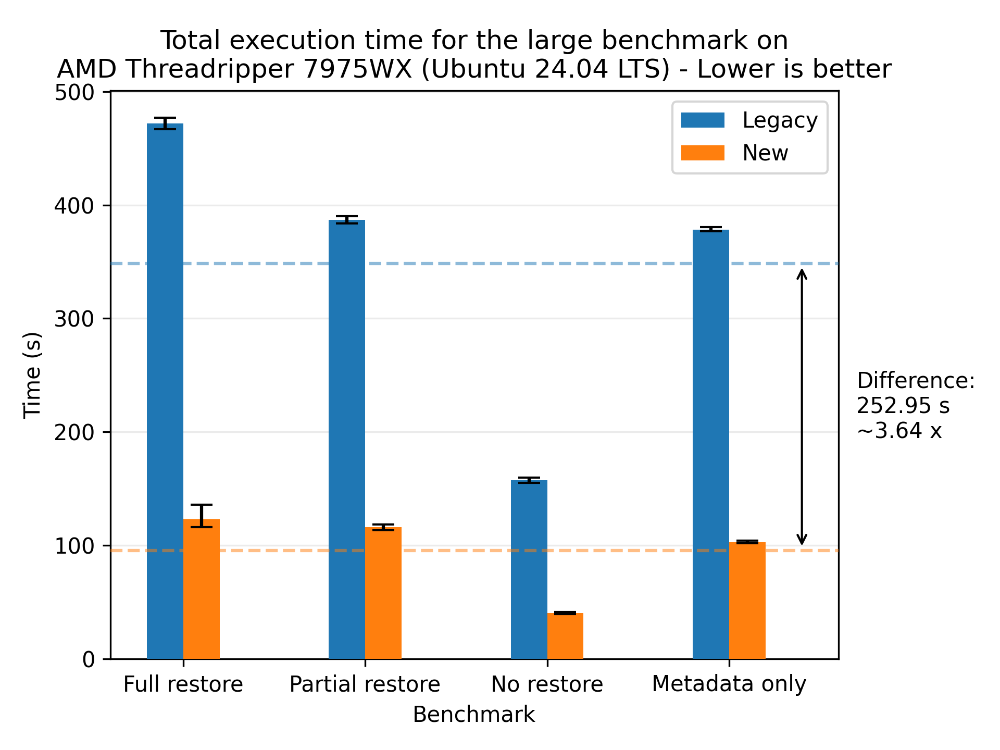
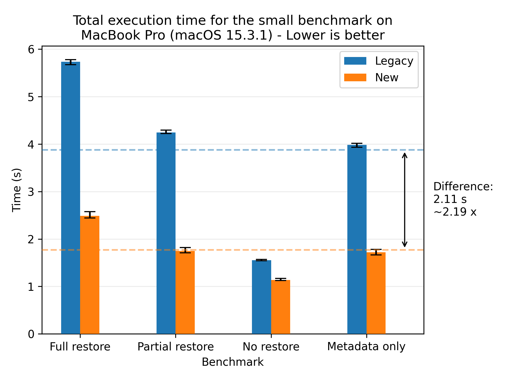
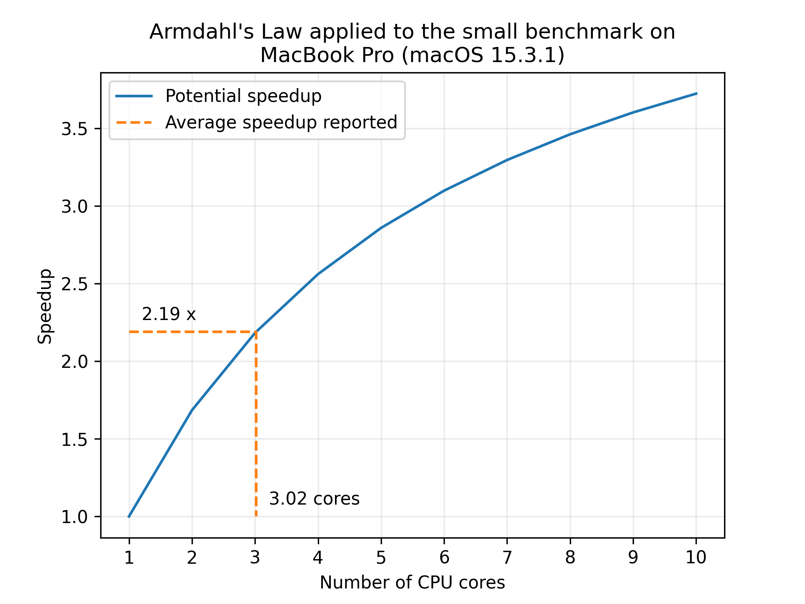
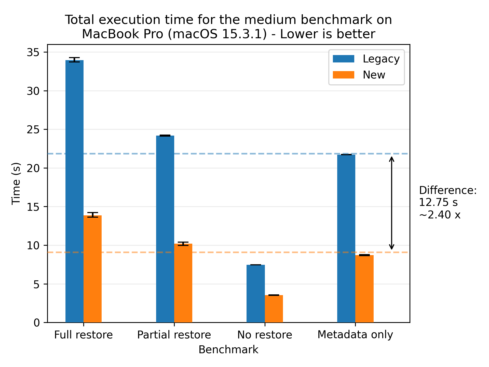
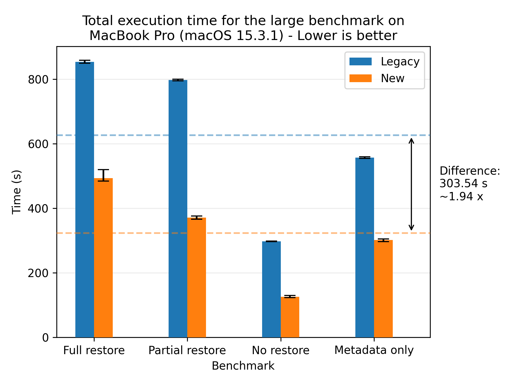
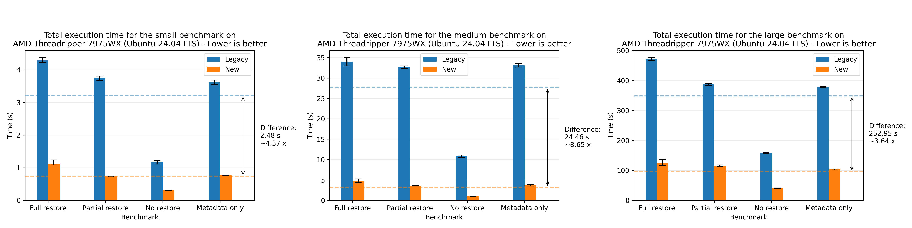

# Speeding up the restore operation by 2x - 8x

This blog post describes the reworked restore flow.

It was originally merged in [PR #5728](https://github.com/duplicati/duplicati/pull/5728), with bugfixes in [PR #5840](https://github.com/duplicati/duplicati/pull/5840), [PR #5842](https://github.com/duplicati/duplicati/pull/5842), [PR #5886](https://github.com/duplicati/duplicati/pull/5886), [PR #5958](https://github.com/duplicati/duplicati/pull/5958), [PR #6026](https://github.com/duplicati/duplicati/pull/6026), and with additional optimizations in [PR #5983](https://github.com/duplicati/duplicati/pull/5983), [PR #5991](https://github.com/duplicati/duplicati/pull/5991), [PR #6028](https://github.com/duplicati/duplicati/pull/6028).

It has been part of the canary releases since [Duplicati 2.1.0.103](https://github.com/duplicati/duplicati/releases/tag/v2.1.0.103_canary_2024-12-21) onwards, with the latest version being [Duplicati 2.1.0.111](https://github.com/duplicati/duplicati/releases/tag/v2.1.0.111_canary_2025-03-15), which includes all of the bugfixes and optimizations mentioned above.

The plots generated in this script can be reproduced by running the [benchmark](https://github.com/carljohnsen/duplicati-blogpost/tree/main/WIP-restore/benchmark) and the corresponding [plotting notebook](https://github.com/carljohnsen/duplicati-blogpost/blob/main/WIP-restore/benchmark/plotting.ipynb).

If any issues arise with the new flow, please report them here on the forum and the legacy flow can still be used instead by supplying the option `--restore-legacy=true`. The legacy flow is also more memory efficient, so if you're running into memory or disk space issues, you can try the legacy flow.

## TL:DR;

The legacy restore flow is slow because it's performed sequentially. The restore flow is rewritten to leverage concurrent execution, reducing the restore time by 3.80 times on average at the cost of increased memory, disk and CPU utilization. The new flow can be tuned to balance the resource usage and the restore time.

## Machine setup

The following table shows the different machines mentioned:

| Machine          | CPU                                    | RAM                                  | Disk (theoretical peak)                | OS                   | .NET    |
| ---------------- | -------------------------------------- | ------------------------------------ | -------------------------------------- | -------------------- | ------- |
| MacBook Pro 2021 | (ARM64) M1 Max 10-core (8P+2E) 3.2 GHz | 64 GB LPDDR5-6400 ~400 GB/s          | 1 NVMe SSD ~5 GB/s                     | macOS Sequoia 15.3.1 | 8.0.404 |
| AMD 7975WX       | (x86_64) 32-core 4.0 GHz (5.3)         | 512 GB DDR5-4800 8-channel ~300 GB/s | 2 PCIe 5.0 NVMe SSD in Raid 0 ~28 GB/s | Ubuntu 24.04.1 LTS   | 8.0.114 |
| AMD 1950X        | (x86_64) 16-core 3.4 GHz (4.0)         | 128 GB DDR4-3200 4-channel ~200 GB/s | 2 PCIe 3.0 NVMe SSD in Raid 0 ~ 8 GB/s | Ubuntu 22.04.4 LTS   | 8.0.110 |
| Intel W5-2445    | (x86_64) 10-core 3.1 GHz (4.6)         | 128 GB DDR5-4800 4-channel ~150 GB/s | 1 PCIe 4.0 NVMe SSD ~8 GB/s            | Ubuntu 22.04.5 LTS   | 8.0.112 |
| AMD 9800X3D      | (x86_64) 8-core 4.7 GHz (5.2)          | 96 GB DDR5-6400 2-channel ~100 GB/s  | 1 PCIe 5.0 NVMe SSD ~14 GB/s           | Windows 11 x64       | 8.0.403 |

## Termonology

We'll be using the following terms in this post:

- _Block_: A blob of data. A file is made up of one or more blocks.
- _Volume_: A zip file containing one or more blocks.
- _Source file_: The original file that was backed up.
- _Target file_: The target file that is being restored. It may be the same path as source, depending on the `--restore-path` parameter.
- _File filter_: The filter that is used to select which files to restore. E.g. for a full restore, the filter would be `"*"`.
- _Local_: The machine that is performing the restore. It may be the same machine as the backup was performed on, but it doesn't have to be.
- _Remote_: The provider storing the backup. E.g. Amazon S3, local file, an SSH server, ...
- _Local database_: The database that keeps track of which files a backup contains, which blocks make up each file, and in which volumes the blocks are stored.
- _Flow_: A sequence of processing steps that are performed in a specific order. A flow can be sequential, parallel, or a combination of both.
- _Legacy flow_: The restore flow that has been in use for many years.
- _New flow_: The restore flow that has been rewritten to be parallelized and is the subject of this blog post.
- _[Communicating Sequential Processes (CSP)](https://www.cs.cmu.edu/~crary/819-f09/Hoare78.pdf)_: A programming paradigm that models concurrent systems as a network of independent processes that communicate through channels. In Duplicati, the CSP library [CoCoL](https://github.com/kenkendk/cocol) is used, but in principle any CSP library could be used. It was chosen since it is already being used in Duplicati, especially in the backup flow.
- _Process_: A CSP process that sequentially performs a specific task, only sharing data through channels. A process can be a thread, a coroutine, or any other form of concurrent execution.
- _Channel_: A CSP channel that is used to communicate between processes. A message can be any object. A channel can be unbuffered, meaning a synchronous/rendezvous channel where the sender and receiver must be ready to communicate, or buffered, meaning an asynchronous channel where the sender can send a message without the receiver being ready to receive it up to a certain buffer size.

# The old restore flow

Before describing the new flow, there's value in understanding the old restore flow, its strengths and weaknesses.
The legacy restore flow is as follows:

1. Combine file filters.
2. Open or restore the local database.
3. Verify the remote files;
   1. Get the list of remote volumes.
   2. Verify that there are no missing or unexpected extra volumes.
4. Prepare the block and file list.
5. Create the directory structure.
6. Scan the existing target files.
7. Scan for existing source files.
8. Patch with local blocks.
9. Get the list of required volumes to download.
10. For each volume:
    1. Download the volume.
    2. Decrypt the volume.
    3. Decompress the volume.
    4. For each block in the decompressed volume:
       1. Extract the block from the zip file.
       2. Check that the size and block hash matches.
       3. Patch all of the target files that need this block.
11. Restore metadata; for each target file:
    1. Download the volume that contains the metadata.
    2. Decrypt the volume.
    3. Decompress the volume.
    4. Extract the metadata from the zip file.
    5. Check that the size and block hash matches.
    6. Restore the metadata from the block(s).
12. Verify the restored files; for each target file:
    1. Read the target file.
    2. Compute the hash of the target file.
    3. Check that the hash and size matches.

The flow is visualized in the following diagram:

This flow has several benefits:

- There is a clear separation of the different steps.
- Volumes are only downloaded once.
- Blocks are only extracted once.
- The flow has a low memory and disk footprint.
- The flow is stable, as it has been in use for many years.

It has the following drawbacks:

- The separation of steps can lead to multiple passes over the same data, moving in and out of memory and disk.
- Each step is sequential, thus not fully utilizing system resources or leveraging overlapping execution. This results in the flow potentially being very slow.
- Block writes are scattered across disk, leading to potentially slow writes, as disks favor sequential access patterns.

# The new restore flow

The new restore flow tackles the problems of the legacy restore flow while retaining as many of its benefits as possible.

## Scattered block writes

Instead of minimizing the number of remote downloads, we'll shift the focus from volume centered to being file centered.
This shift results in blocks being written sequentially to disk for each file, which is a more disk-friendly access pattern.
The major problem with this approach is that each file does not know how deduplicated blocks are shared between files.
As such, multiple files would download the same volume multiple times, alongside decryption and decompression; a lot of redundant work.

To solve this, we introduce a new cache system that keeps track of which blocks are needed for each file and ensures that each block is only downloaded, decrypted, and decompressed once.
The cache system is split into two parts: a volume cache and a block cache.
The volume cache keeps track of which volumes are needed for each file and ensures that each volume is only downloaded once.
It is decrypted and stored on disk in a temporary folder, until it is no longer needed at which point it is deleted.
The block cache keeps track of how many times a block is needed throughout the restoration flow, and ensures that each block is only decompressed once.
If it is needed more than once, it is stored in a dictionary in memory, until it is no longer needed at which point it is deleted.

While the reads from the remote storage are still scattered, they don't (usually) suffer as much, given that the dblock size is many times larger than the block size of a backup.
Furthermore, the extraction of blocks from the volumes are performed in memory where random access is much faster.

The only problem that this approach introduces is that the cache system needs to be managed, which can be a complex task.
For systems with limited memory and disk space, we provide tunable parameters to control the size of the caches.
This allows the user to trade off between speed and resource usage.
If the volume cache is small, the system will download volumes multiple times.
For setups with a high-speed connection to the remote storage, this may be a good trade-off.
If the block cache is small, the system will decompress blocks multiple times.
For setups with limited memory, this may be a good trade-off, since the restore operation is still able to complete, albeit slower than with the caches fully utilized.

However, these caches are only really utilized when there's high deduplication between files, so the caches shouldn't grow too large.

Future work would analyze the deduplication of the blocks and the volumes across files, to further optimize the cache utilization by restoring the files in order to maximize sharing.
The worst case can occur when the order of files is such that the caches don't get auto evicted and the system runs out of memory or disk space.
The aforementioned future work would alleviate this problem.
However, in our testing (futher down in this post) this was rarely an issue.

## Parallelization and overlapping execution

To fully utilize the system resources, we parallelize the restore flow and allow for overlapping execution of the different steps.
This is done by reworking the core steps 4 onwards.
In particular, most of the time spent in the legacy flow is step 10 (downloading, decrypting, decompressing, and patching blocks) and step 12 (verifying the restored files).

The new flow is as follows:

1. Combine file filters.
2. Open or restore the local database.
3. Verify the remote files;
   1. Get the list of remote volumes.
   2. Verify that there are no missing or unexpected extra volumes.
4. Start the network of concurrent processes.
   1. The filelister process lists the files that need to be restored.
   2. The fileprocessor will restore the files.
      1. Receive a filename
      2. Figure out which blocks are needed for the file.
      3. Check how many blocks the target file already has, as they don't need to be restored.
      4. Check how many blocks the source file has, as they can be copied directly.
      5. Request the missing blocks. The blocks are requested in a burst to increase throughput as the network is more likely to be kept busy with requests.
      6. Patch the target file with the blocks received blocks.
      7. Verify that the target file matches the expected size and hash.
      8. Request the metadata blocks.
      9. Restore the metadata.
   3. The block manager will respond to block requests, caching the blocks extracted from volumes in memory. It starts by computing which blocks and volumes are needed during the restore and how many times each block is needed from each volume. This is used to automatically evict cache entries when they are no longer needed to keep the footprint of the cache low.
      1. If the requested block is in the cache (in memory), it will respond with the block from the cache.
      2. If the requested block is not in the cache (in memory), it will request the block from the volume manager. When receiving the block from the volume cache, it will notify all of the pending block requests. If the number of pending requests are lower than the amount of times the block is needed, it will store the block in the cache. Otherwise, the block will be discarded. It will also notify the volume manager when the volume can be evicted from the cache.
   4. The volume manager will respond to volume requests, caching the volumes on disk. The block manager is keeping count of the number of times each block is needed and will notify the volume manager when a volume can be evicted from the cache.
      1. If the volume is in the cache (on disk), it will request the block to be extracted from the volume.
      2. If the volume is not in the cache (on disk), it will request the volume to be downloaded. Once the volume is downloaded, it will request the block to be extracted from the volume.
   5. The volume downloader will download the volume.
      1. Receive a volume request.
      2. Download the volume.
      3. Send the downloaded volume to the volume decryptor.
   6. The volume decryptor will decrypt the volume.
      1. Receive a volume.
      2. Decrypt the volume.
      3. Send the decrypted volume to the volume cache.
   7. The volume decompressor will decompress the volume.
      1. Receive a volume.
      2. Extract the block from the volume.
      3. Verify that the block matches the expected size and hash.
      4. Send the extracted block to the block cache.

The flow is visualized in the following diagram:

The implementation of each process in the process network can be seen in the respectively named files in the [`Duplicati/Library/Main/Operation/Restore` folder](https://github.com/duplicati/duplicati/tree/master/Duplicati/Library/Main/Operation/Restore).

With this setup, each process in step 4 can run asynchronously, allowing for overlapping execution.
Furthermore, some of the processes can run in parallel, allowing for using more system resources at the bottleneck steps.
In particular, the core work of downloading (4.5 Volume Downloader), decrypting (4.6 Volume Decryptor), decompressing (4.7 Volume Decompresor), and patching blocks (4.1 File Processor) is parallelized. Each of these steps can be scaled individually to maximize the utilization of the system resources.

A major benefit is that the post verification step has been removed as it's now performed on the fly during the restore flow. This was separated in the legacy flow as the block writes were scattered, meaning each file was not ensured fully restored until the end of the flow. In the new flow, each file processor knows exactly when each file is fully restored and can thus verify while it is being restored.

The whole network shuts down starting at the filelister, once it runs out of files to request.
Then each fileprocessor shuts down when trying to request a file from the filelister, which is no longer available.
Once all fileprocessors have shut down, the block cache signals the volume cache to shut down, which in turn shuts down the volume downloaders, volume decryptors, and volume decompressors.
Once that subnetwork has shut down, the block cache shuts down, which is the final process to shut down.

This new flow alleviates the problems of the legacy flow, while retaining most of its benefits:

- While the steps are no longer performed in a clearly separated sequence, each step is still separated into a process allowing for a clear separation of concerns.
- The steps are executed concurrently, allowing for overlapping execution and better utilization of system resources.
- The block writes are sequential to a file, leading to a more disk-friendly access pattern per file written.
- The cache system ensures that each block and volume is only downloaded, decrypted, and decompressed once
  (assuming that cache entries aren't evicted too early due to memory limitations).
- The verification is now performed integrated into the restore flow.

It has the following drawbacks:

- The flow is more complex, as it is now a network of processes that communicate through channels. This can, in the worst case, lead to deadlocks where the system is stalled without any progression. Hewever, we have added timeout detection that will warn the user if the system is seemingly stalled. We have also tried to ensure that any error will terminate the network, so the system will not be stuck indefinitely.
- The cache system needs to be managed, which can be a complex task, and that entails increased resource consumption. However, in our testing, most of the work spent was not managing cache, but actual work; downloading, decrypting, decompressing, and patching blocks.
- The flow is less stable, as it is a new implementation that hasn't been tested as thoroughly as the legacy flow. Given more time and use, confidence in the new flow will increase.

## Additional optimizations

In addition to the new flow, we've added several optimizations to the restore flow:

- **Preallocation**: The target files can be preallocated, hinting the size to the filesystem. This can benefit the restore speed on some systems, as it hints the size to the filesystem, potentially allowing for more efficient file allocation (e.g. less fragmentation).
- **Parallel downloads**: The BackendManager now supports parallel downloads, allowing for multiple volumes to be downloaded at the same time. This can increase the throughput of the restore operation, especially on high-speed connections. In the benchmarks of this post, the backend was a local filesystem, so this optimization really sped up the restore operation.
- **Parallel database connections**: With respect to the backup database, the restore operation is a non-intrusive operation, where the database is only being read from. As such, we can open multiple connections to the database, allowing for faster access to the database.
- **Memory pool**: The memory pool is a shared memory pool that is used to allocate memory for the blocks. Rather than using a new memory allocation for each block, the memory pool is used to allocate memory for the blocks, which is returned after use. This alleviates garbage collection penalties as a result of many small memory allocations.

## Tunable parameters

This new flow introduces several tunable parameters to control parallelism, the size of the caches, and toggling the legacy flow:

### Cache

- `--restore-cache-max=4gb`: The size (in bytes) of the block cache. The default is 4 GiB. If the cache is full, the cache will be compacted according to the strategy of [MemoryCache](https://learn.microsoft.com/en-us/dotnet/api/microsoft.extensions.caching.memory.memorycache).
- `--restory-cache-evict=50`: The percentage of the block cache that will be evicted when the cache is full. The default is 50%.

### Parallelism

- `--restore-file-processors=n_cores/2`: The number of file processors to run in parallel. The default is half the number of cores available on the machine.
- `--restore-volume-decompressors=n_cores/2`: The number of volume decompressors to run in parallel. The default is half the number of cores available on the machine.
- `--restore-volume-decryptors=n_cores/2`: The number of volume decryptors to run in parallel. The default is half the number of cores available on the machine.
- `--restore-volume-downloaders=n_cores/2`: The number of volume downloaders to run in parallel. The default is half the number of cores available on the machine.
- `--restore-channel-buffer-size=8`: The size of the channel buffer. The default is 8. This can be increased to allow for more messages to be in flight, potentially increasing the throughput of the restore operation at the cost of increased memory usage.

### General

- `--restore-legacy=false`: Toggles whether to use the legacy restore flow. The default is false, enabling the new restore flow.
- `--restore-preallocate-size=false`: Toggles whether to preallocate the target files. The default is false, not preallocating the target files. This can benefit the restore speed on some systems, as it hints the size to the filesystem, potentially allowing for more efficient file allocation (e.g. less fragmentation).
- `--internal-profiling=false`: Toggles whether keep internal timers of each part of the restore flow. The default is false, not keeping internal timers. This is useful for tuning the parallelism parameters as the bottleneck processes can be identified.

# Results

The new restore flow has been tested on the machines outlined in the Machine setup section.
We perform the following tests:

- **Full restore** - The target directory of the restore is empty.
- **Partial restore** - The target directory contains 50 % of untouched files, 25 % of files are missing, and 25 % of files have a single modified block.
- **No restore** - The target directory contains all of the files in their expected state. Metadata is skipped, so this test should not be fetching from remote storage.
- **Restore metadata** - The target directory contains all of the files, but each file has an incorrect timestamp, leading to only the metadata being restored.

Each test will be performed with the new flow and the legacy flow, with 10 measured runs. For each configuration, the best and worst times are discarded and the reported times are plotted with error bars. The benchmarks are (unless specified otherwise) performed on local storage, as we're focusing on the execution of the restore process. For Windows we've disabled Windows Defender real-time protection as this does not go well with a disk-stressing benchmark. We'll be using three datasets:

| Dataset        |     Files |   Size | Max file size | Duplication rate |
| -------------- | --------: | -----: | ------------: | ---------------: |
| Small dataset  |     1,000 |   1 GB |         10 MB |              20% |
| Medium dataset |    10,000 |  10 GB |        100 MB |              30% |
| Large dataset  | 1,000,000 | 100 GB |        100 MB |              40% |

'Files' is the target number of files, 'Size' is the target size, and 'Max file size' is the maximum file size a single file can have. Each of these values are targets, which means that they'll be approximate. They will however be deterministic across the runs and machines, as they're using the same seed during generation. Duplication rate is the percentage of blocks that already exist in another file. This is implemented by having the files being filled with 0s.

## General results

We'll start by presenting the general results of the new restore flow compared to the legacy restore flow. Let's look at the results for the small dataset on the MacBook:

Here we see a significant speedup for the new restore flow compared to the legacy restore flow, yielding a speedup of 2.19x on average. The error bars show the fastest and slowest runs, which are quite close to the average. This indicates that the new restore flow is stable and performs consistently across runs.

If we look at a profiled run of the legacy flow, we see that `3641 + 1541 + 839 = 6021 ms` of the time is spent on restore, metadata and verification in the new restore flow, compared to the total 7408 ms. This means that ~83 percent of the workload is parallelizable. If we apply Armdahl's law:

We see that a speedup of 2.19 correlates with 3 cores being utilized. This is not quite as far as we'd like, but that was assuming that the entire workload was parallelizable. In practice, there are some sequential parts of the workload, such as the network and disk I/O, that are not parallelizable, so this rough estimate of the speedup is seemingly quite good.

Let's look at the results for the medium dataset:

Here we see the speedup becoming more pronounced, with a speedup of 2.40x on average. The error bars are even tighter than for the small dataset.

Let's look at the results for the large dataset:

Where we see a speedup of 1.94x on average.
And for completeness, we also show the plots for all of the other machines, where the most performant run was the AMD 7975WX on the medium dataset with a speedup of 8.65x on average:

There's a small discrepancy in the performance numbers from the Windows machine, which we are yet to investigate. The performance numbers are still within the expected range when comparing relatively to the legacy flow, so we're not too concerned about it.

## Effects of the sparsity of the data

One strength of the legacy approach is that it only downloads volumes once, then extracts a block from the volume and patches the target files that need the block.
This allows for quite efficient use of the extracted blocks, leading to a high deduplication results in higher performance.
The new approach tries to leverage the same deduplication through the block and volume caches, so let us look at the effect of the deduplication rate on the performance of the two restore flows:

Here we see that both flows benefit from higher deduplication rates, and the new flow is consistently faster than the legacy flow.
Looking at the absolute numbers, the new flow is seemingly less affected by the deduplication rate, as the variance in performance is lower than for the legacy flow.
However, to be sure, we look at the normalized times, where each flow is scaled to their respective best time:

This plot shows that both flows follows the same trend, so we can conclude that the cache system allows for the new flow also leverages the deduplication rate.

## Effects of multiple FileProcessors on HDDs

The new restore flow focuses on sequential writes to disk, which is beneficial for HDDs, especially compared to the legacy restore flow, which scatter the block writes across the disk.
To see the effect of this, we scale the number of FileProcessors on the 9800X3D, which has two additional 3 TB HDDs. We'll be backing up to one disk and restoring to the other disk.
We'll be using the medium dataset for this test:

Here we see that the new restore flow is faster than the legacy restore flow, with a speedup of TODOx on average even though both flows are able to keep the target disk at almost 100% utilization.
This means that the added parallelism of the new restore flow is neglible as both are limited by the disk speed.
We do still have some gain in performance, which is due to the on-the-fly verification of files, which saves us an entire pass over the data.

There is still some merit in running multiple FileProcessors, as the new restore flow reaches the saturation point at 4 FileProcessors.
The disk reaches saturation at around 4 FileProcessors, where the latency of the disk results in diminishing returns.
The benefits become more pronounced as the load to disk decreases, which we can see in the "no restore" benchmark.

## Preallocation on HDDs

Preallocation hints the size of the target files to the filesystem, potentially allowing for more efficient file allocation (e.g. less fragmentation).
This should be especially beneficial for HDDs, as they are prone to fragmentation.
To see the effect of this, we'll be running the medium dataset on the 9800X3D with and without preallocation:

Here we see a slight speedup for 8 FileProcessors, which doesn't really confirm the hypothesis, as the speedup is within the margin of error.
However, the preallocation does hint the size of the files to the filesystem, which can be beneficial for the long-term health of the filesystem.
Furthermoree, this effect is likely due to the fact that the target disk is quite new and unused, so fragmentation is not as big of an issue as it would be on a disk that has been used for a while.
Regardless, providing the hint doesn't hurt the performance, so enabling it for HDD based systems is recommended.

# Future work

## Automatic tuning of parameters

The default parameters for the new restore flow works reasonably well for most setups, but there is still room for improvement.
Our own lightweight testing shows that there's about an extra 10 % of performance to gain by tuning the parameters.
However, the parameters aren't widely applicable across different setups, and the current process is quite manual.
Future work will have a tool that'll automatically tune the parameters for the user's setup, by running a few test restores and adjusting the parameters based on the results.

## Direct storage access

While the new restore flow is faster, we're still not achieving the maximum throughput of the storage.
One reason could be that the storage is being cached by the operating system, leading to suboptimal performance.
This is because the data is not being used frequently enough to reap the benefits of the cache.
The data written to the target file is no longer needed, so there's no reason to keep it in the cache.
The same goes for the volumes, where only the final decrypted volume is accessed multiple times.
For SATA drives and the like, the speeds are so low that the cache is not a bottleneck, but for high-speed NVMe drives, the cache can be a bottleneck.

To alleviate this, we could use direct storage access (`O_DIRECT` on NIX systems and `FILE_FLAG_NO_BUFFERING` on Windows systems), bypassing the operating system cache.
Previous projects have shown that this is a requirement to reach the maximum throughput of the storage.
It's a non-trivial task, as it requires the data to be aligned correctly and the sizes to be multiples of the block size of the storage, which is why it's being left for future work.

## Deeper investigation of the Windows performance

The performance numbers from the Windows machine are slightly off (in absolute numbers) compared to the other machines. This is strange because the CPU is quite powerful and the storage is fast.
This may be attributed to the Direct Storage access, but at the time of writing we're unsure of the cause.

# Conclusion

In this blog post, we've presented the new restore flow, which is a rework of the legacy restore flow to leverage concurrent execution and reduce the restore time.
The new flow is able to reduce the restore time by 3.80 times on average across all benchmarks, at the cost of increased memory, disk, and CPU utilization.
The new flow can be tuned to balance the resource usage and the restore time, by adjusting the cache sizes and the number of parallel processes.
The new flow is able to utilize the system resources more aggressively compared to the legacy restore flow, leading to a faster restore time.
