# Unleashing the power of SQLite to C#

This blog post describes different implementations, optimizations, tunes, and benchmarks of SQLite.
While the work is motivated by the Duplicati project, it is not limited to it, leading to these findings being applicable to other projects as well.

## TL;DR

- Choosing the right database schema and index does have an effect. For Duplicati, there is some gain (~20 %) in restructuring, but it's left as a later task.
- Tuning a SQLite database with pragmas can lead to significant performance improvements. The major pragmas being `mmap_size`, `cache_size` and `journal_mode=WAL`. Combining these could lead to up to 5.7x improvement on write-heavy workloads on Windows.
- Parallelizing database operations with multiple connections is beneficial for read-heavy workloads, but quickly deteriorates performance for write-heavy workloads.
- SQLite favors large transactions, providing over 66x performance for certain workloads.
- The C# SQLite providers are competitive to the C API, with Microsoft.Data.Sqlite being the fastest.
- Implementing the asynchronous Microsoft.Data.Sqlite backend in Duplicati has shown promising results. With Duplicati in a database stressing state it now performs Ax, Bx, Cx, and Dx times better for backup, recreate, restore, and delete operations respectively.

TODO ABCD numbers

## Machine setup

The following table shows the different machines mentioned:

| Machine          | CPU                                    | RAM                                  | Disk (theoretical peak)                | OS                   | .NET    |
| ---------------- | -------------------------------------- | ------------------------------------ | -------------------------------------- | -------------------- | ------- |
| MacBook Pro 2021 | (ARM64) M1 Max 10-core (8P+2E) 3.2 GHz | 64 GB LPDDR5-6400 ~400 GB/s          | 1 NVMe SSD ~5 GB/s                     | macOS Sequoia 15.6.1 | 9.0.101 |
| AMD 7975WX       | (x86_64) 32-core 4.0 GHz (5.3)         | 512 GB DDR5-4800 8-channel ~300 GB/s | 2 PCIe 5.0 NVMe SSD in Raid 0 ~28 GB/s | Ubuntu 24.04.3 LTS   | 9.0.300 |
| AMD 1950X        | (x86_64) 16-core 3.4 GHz (4.0)         | 128 GB DDR4-3200 4-channel ~200 GB/s | 2 PCIe 3.0 NVMe SSD in Raid 0 ~ 8 GB/s | Ubuntu 24.04.1 LTS   | 9.0.101 |
| Intel W5-2445    | (x86_64) 10-core 3.1 GHz (4.6)         | 128 GB DDR5-4800 4-channel ~150 GB/s | 1 PCIe 4.0 NVMe SSD ~8 GB/s            | Ubuntu 22.04.5 LTS   | TODO    |
| AMD 9800X3D      | (x86_64) 8-core 4.7 GHz (5.2)          | 96 GB DDR5-6400 2-channel ~100 GB/s  | 1 PCIe 5.0 NVMe SSD ~14 GB/s           | Windows 11 x64       | TODO    |

The plots presented in this blog post is from the AMD 9800X3D, but plots for the other machines are also available.

# Introduction

Internally, Duplicati uses SQLite to keep track of the files, their blocks, the file hashes, the block hashes, etc.
The reason for using SQLite is that it is a self-contained file-based database, which makes it easy to deploy and use without needing a separate database server.
Furthermore, it's a mature and well-tested database engine, it's lightweight, and it has a small footprint, all of which should make it a good fit for Duplicati, both in terms of performance, stability, deployability, and ease of use.

However, achieving high performance with SQLite requires some tuning and optimizations, especially when dealing with large datasets and high query rates.
This became especially apparent as SQLite should be able to handle close to 1M queries per second, but during Duplicati's recreate database operation we saw significantly lower performance.
Here we found that a considerable amount of time spent was a series of SQL queries, especially the pattern; `SELECT`, return row if found, otherwise, `INSERT` a new row.
As the database grew, each query would take longer and longer, starting at around 200k queries per second, ending below 50k queries per second, with steadily decreasing performance.
This led to this investigation, as SQLite is supposed to be fast, and it was not performing as expected.
Even the initial throughput of 200k queries per second was nowhere near the 1M queries per second that SQLite should be able to do.

This blog post isolates SQLite from Duplicati to investigate the performance of SQLite itself to find out what is causing the slowdown.
While the motivation originates from Duplicati, this investigation is self-contained and can be applied to other projects as well.

# Benchmarks

We're going to run on a simple database schema, with two tables that mimic some found in Duplicati:

```sql
CREATE TABLE "Blockset" (
	"ID" INTEGER PRIMARY KEY,
	"Length" INTEGER NOT NULL
);

CREATE TABLE "BlocksetEntry" (
	"BlocksetID" INTEGER NOT NULL,
	"BlockID" INTEGER NOT NULL
);

CREATE TABLE "Block" (
	"ID" INTEGER PRIMARY KEY,
    "Hash" TEXT NOT NULL,
	"Size" INTEGER NOT NULL
);
```

The `Blockset` table represents a set of blocks.
The `Block` table represents individual blocks, where each block has a hash and a size.
The `BlocksetEntry` table represents the relationship between a blockset and its blocks, allowing for multiple blocks to be associated with a single blockset.

In our benchmarks, the `Blockset` table will showcase the most simple database schema (two integers, with one being the id), the `Block` table will showcase a more complex schema (a string and an integer), and the `BlocksetEntry` table will showcase a many-to-many relationship between the two tables.

We will run the following benchmarks:

## Select

We start by the simplest query, selecting a row from the `Block` table, which is quite commonly used in Duplicati:

```sql
SELECT ID FROM Block WHERE Hash = ? AND Size = ?;
```

## Insert

Similar to the select, we also want to benchmark inserting a row into the `Block` table:

```sql
INSERT INTO Block (Hash, Size) VALUES (?, ?);
```

## Select xor insert `Block`

As mentioned, this is a common pattern in Duplicati, where we first try to select a row, and if it does not exist, we insert it.
We will benchmark two different approaches to this:
Two statements, with the check performed in C#:

```sql
SELECT ID FROM Block WHERE Hash = ? AND Size = ?;
```

Perform check in userspace, then insert if not found:

```sql
INSERT INTO Block (Hash, Size) VALUES (?, ?);
```

And we also want to measure the impact of moving the data back to userland, by comparing to a combined statement with the check performed in SQL:

```sql
INSERT OR IGNORE INTO Block (Hash, Size) VALUES (?, ?);
SELECT ID FROM Block WHERE Hash = ? AND Size = ?;
```

## Select from Join

As the tables in Duplicati are often very small (schema-wise), but interconnected, we also want to benchmark a join query.
We will select all blocks in a blockset:

```sql
SELECT Block.ID, Block.Hash, Block.Size
FROM Block
JOIN BlocksetEntry ON BlocksetEntry.BlockID = Block.ID
WHERE BlocksetEntry.BlocksetID = ?;
```

## Adding blocksets

Finally, we want to benchmark the process of adding blocksets, where we first create a new blockset:

```sql
INSERT INTO Blockset (Length) VALUES (0);
SELECT last_insert_rowid() AS ID;
```

Then we either pick an existing block or create a new one. Then check if the block already exists:

```sql
SELECT ID FROM Block WHERE Hash = ? AND Size = ?;
```

If it does not exist, we insert it:

```sql
INSERT INTO Block (Hash, Size) VALUES (?, ?);
SELECT last_insert_rowid();
```

Link up the rows through the `BlocksetEntry` table:

```sql
INSERT INTO BlocksetEntry (BlocksetID, BlockID) VALUES (?, ?);
```

And increment the length of the blockset:

```sql
UPDATE Blockset SET Length = Length + 1 WHERE ID = ?;
```

Then with some probability, we'll start a new blockset.

# Tuning

As this blog post focuses on isolating the performance of SQLite, we will start with a C++ implementation, to avoid any overhead from C#. This will allow us to obtain a best-case baseline, which we can then compare against the C# implementations.
We will be using all of the compiler optimizations available (`-O3 -march=native -mtune=native -flto` on Linux and `/favor:AMD64 /O2` on Windows), and we will be using the `sqlite3` C API directly, to avoid any overhead from higher-level libraries.
To further maximize performance, we will use prepared statements and each query will be run in a transaction.
When applicable, we'll be measuring the performance of the raw query: bind, step[, column], and reset.
For others, we'll be measuring the performance of a transaction, which either contains a single query, or a bunch of them.

## Indexes and schema changes

Since our motivation came from Duplicati’s slowdown on basic queries, we start by looking at whether changes to the schema or indexes alone could resolve the performance gap. We'll only be looking into insert and select benchmarks here.
The database is created from scratch for every benchmark, because we want to investigate the effect on the indices as if they're built "on-the-fly". Deleting and creating the indices only could result in better balance, and it'll put the database in an incorrect state (compared to what we'd expect in the real world).

Duplicati already uses indices, so there's not much we can do in terms of adding new indices.
However, we can modify the schema to ease the work needed by the database engine, hopefully leading to better performance.
Especially, we'll see if we can modify the `Hash` column in the block table, which is currently a `TEXT` column, and we'll investigate different indexing strategies for each of the modified schemas, which should allow for smaller, and thus faster, indices. Whether this is actually the case will be investigated in the benchmarks.
We will investigate the following:

1. The normal `Hash` column as a `TEXT` column, with the index on `(Hash, Size)`.
2. 1 with the index on `Hash` only,. This means that since the query will result in multiple rows, we will have to filter the results in userland to find the correct row.
3. 1 with the index on `Size` only, further filtering in userland.
4. Change the `Hash` column to a `BLOB` column, which is more efficient for storing binary data. This should improve performance, as this should remove any string overhead and the overhead from base64 encoding. Here the index would be on `(Hash, Size)`.
5. 4 with the index on `Hash` only, further filtering in userland.
6. 4 with the index on `Size` only, further filtering in userland.
7. Change the `Hash` column to a `VARCHAR(44)` column, which is more efficient for storing fixed-length strings. Here the index would be on `(Hash, Size)`.
8. 7 with the index on `Hash` only, further filtering in userland.
9. 7 with the index on `Size` only, further filtering in userland.
10. Change the `Hash` column to be four `INTEGER` columns (`h0`, `h1`, `h2`, `h3`) each storing 64-bit integers. This should allow SQLite to index and compare the values more efficiently, as it becomes integer comparisons rather than string comparisons. Like storing as a `BLOB`, this approach also alleviates using base64 encoding. The first index used would be on `(h0, h1, h2, h3, Size)`.
11. 10 with the index on `(h0, Size)` only, further filtering in userland.
12. 10 with the index on `h0` only, further filtering in userland.
13. 10 with the index on `Size` only, further filtering in userland.

Let's start by looking at the performance of insert:

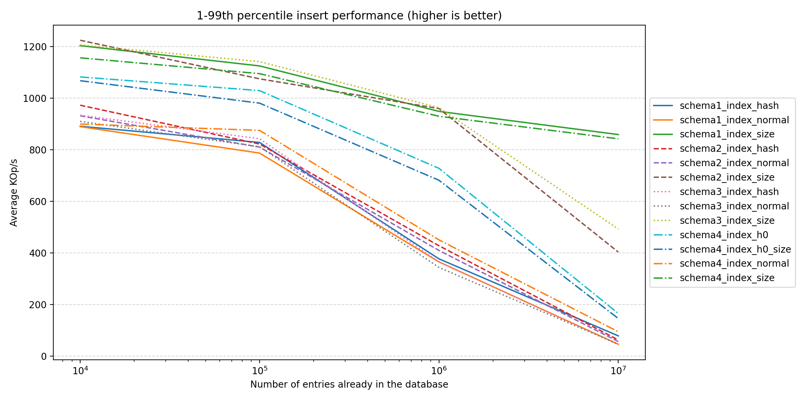

Here we see that all of the size-based index runs out perform all the others. This makes sense, as there's less work in maintaining the overall index, leading to most inserts ending up in the same bucket. The next two winners are the schema 10 with index on either `(h0)` or `(h0, size)`, with the same argument as before to why they're performant.
The rest are grouped towards the bottom, with the original (1.) schema performing the worst. If we focus on the largest run:

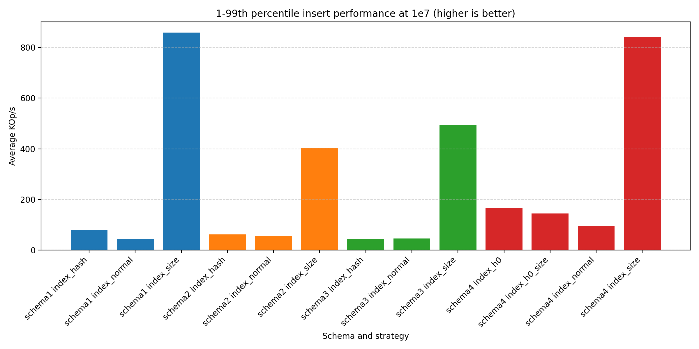

We see the same trends as before: size-based is faster, index only on hashes doesn't provide much. However, it's interesting to note that (10.) performs better than the other "normal" schemas.

Let's turn the attention to select performance:

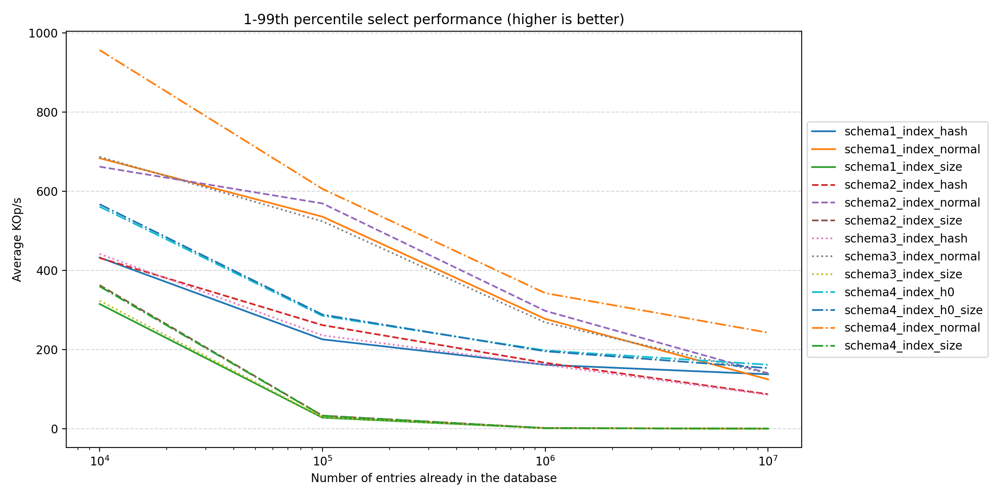

In this benchmark, the roles have reversed; the size-based indexes are no longer the best performers. Instead, the "normal" indexes are now leading the pack, with the original (1.) schema performing surprisingly well. Interesting again, it seems that (10.) performs the best. Let's again look at the largest run:


The bars for the size-based indexes are there, but are too small to properly render on the image. The hash-based ones also perform quite poorly. So for a select heavy workload, the normal indexes are the way to go. The winner is the (10.) schema, which is about 20 % more performant than (1.), meaning there could be some, but not much, value in changing to this scheme. There are two reasons behind its performance:

1. Less data to transfer back and forth, which should also make the index lookups faster
2. With each sub hash being an integer, the comparison should be faster as well.

In a sub-conclusion; if the workload is write-heavy, something like a size-based index could be beneficial, at the cost of poor read performance. For a read-heavy or mixed workload, the normal indexes are the better choice, providing better overall performance. However, as a schema change is an intrusive operation requiring a rippled effect of changes in the codebase and breaking compatibility, it is left as a later task in Duplicati.

## PRAGMAs

A less intrusive way to optimize SQLite is to use PRAGMAs, which are special commands that can be used to change the behavior of the SQLite engine.
We will investigate the following PRAGMAs:

- `synchronous`: This controls how often SQLite flushes data to disk. The default is `FULL`, which is the safest option, but it can be slow as it waits for the OS to confirm that the data is written to disk through a disk sync. We will test with `NORMAL`, which is faster but less safe (it doesn't wait for the disk sync, but instead returns once the data has been handed off to the OS), and `OFF`, which is the fastest but can lead to data loss in case of a crash.
- `temp_store`: This controls where temporary tables are stored. The default is `DEFAULT`, which uses the disk, but we can also use `MEMORY`, which stores temporary tables in memory, leading to faster access times. While we won't be using temporary tables in our benchmarks, this can still lead to performance improvements as SQLite uses temporary tables for certain operations internally.
- `journal_mode`: This controls how SQLite handles transactions. The default is `DELETE`, which is the safest option, but it can be slow as it creates a journal file on disk. We will test with `WAL`, which is faster and allows for concurrent reads and writes. We won't be testing `OFF`, which is the fastest, as it disables journaling entirely, leading to rollbacks having undefined behavior.
- `cache_size`: This controls the size of the SQLite cache, which is used to store recently accessed data. The default is 2000 pages (around 2 MB), but we can increase this to improve performance.
- `mmap_size`: This controls the size of the memory-mapped file used by SQLite. The default is 0, which means that memory-mapping is disabled. We can enable it to improve performance, especially for large databases.
- `threads`: This controls the number of additional threads that SQLite can use as helper threads for prepared statements. The default is 0, which means that SQLite will not launch any additional helper threads.

In addition to these individual PRAGMAs, we'll also test the normal behaviour (no pragmas), as well as a combination of reasonable configurations: `synchronous NORMAL` to slightly slack the durability in exchange for performance, `temp_store MEMORY` as temp stores are removed after a run anyways, `journal_mode WAL` to improve performance and concurrency, `cache_size 64M` for a slight (on modern machines) increase in memory consumption, `mmap_size 64M` for better I/O performance, and `threads 2` as the plots will show that being the sweet spot.

We've run the benchmarks with the same sizes as before, but the biggest impact of the PRAGMAs was seen on 1e6 entries:

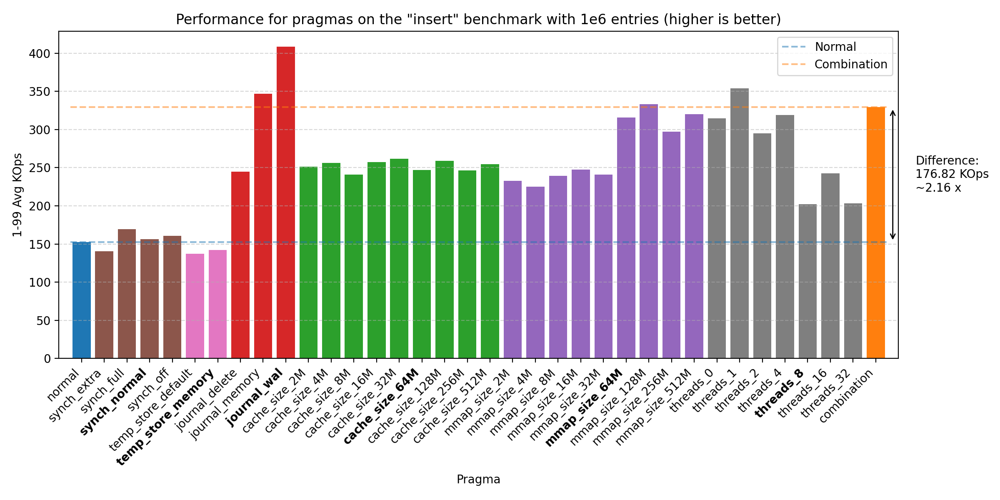


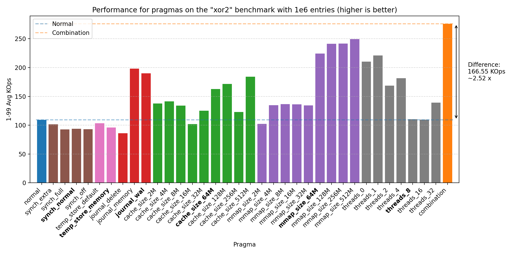
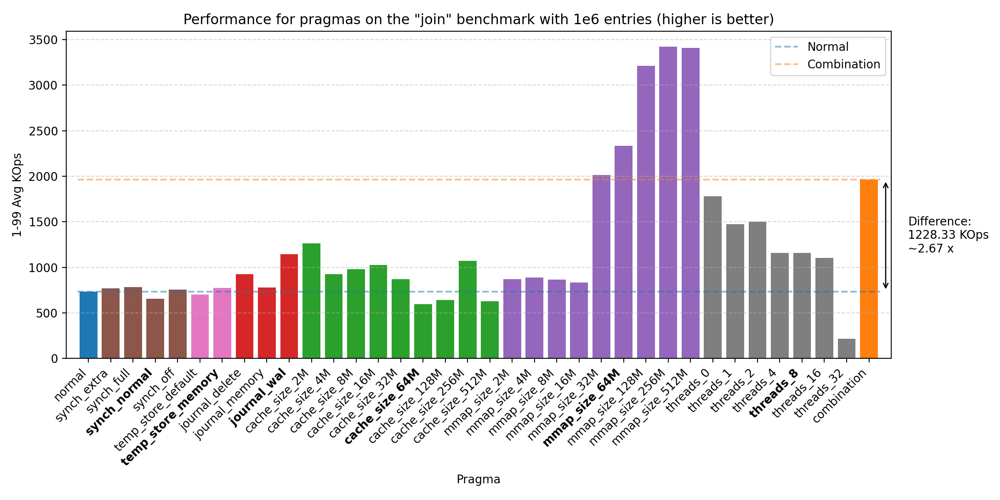


All of these plots show great performance gains, 1.50 - 1.82 times improvement over the baseline. The biggest improvements were seen with `cache_size`, then `mmap_size`, and finally `journal_mode`. The reason why the join benchmark has a lower improvement is likely due to the benchmark already being very fast (notice the y-axis scale changes across plots). We do see that there could be further improvement by increasing the sizes of `cache_size` and `mmap_size`, but setting both at 64M seems to be a good balance.

If we focus the relative performance of 'normal' and 'combination', we can show a plot for all benchmarks across all sizes:

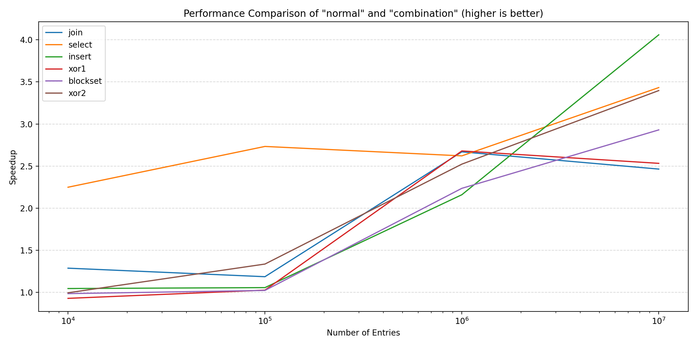

We see that for the larger sizes, the combination of pragmas outperforms the normal configuration. For the smaller sizes, the pragmas do not provide much benefit, performing slightly (~0.96) worse in some cases.

## Parallelization

While the PRAGMAs resulted in measurable performance improvements, we also want to see if we can increase performance through parallelization.
This benchmark evaluates the impact of launching multiple threads accessing the database at the same time. Compared to the previous benchmarks, this changes the transaction strategies. First of all, the transactions become deferred, where they start as a read transaction (allowing concurrent access) and are lifted to a write transaction only when necessary. As a result, each thread must perform one operation in one transaction to ensure data consistency. Second of all, as each step can potentially block, measuring each step is no longer interesting. Instead, we look at the wall clock of running all of the operations, and divide the time by the number of processed elements. Each thread will receive its own set of data to process.

Let's start by looking at the read-heavy benchmarks, 'select' and 'join':


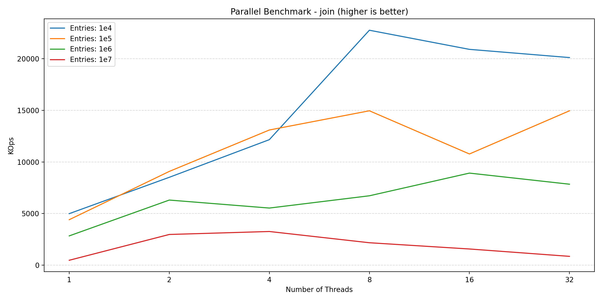

Here we see that both benchmarks benefit from parallelization, scaling nicely along with the number of threads until reaching the saturation point around 8 threads. While these two plots could indicate that parallelization is worth it, looking at the write-heavy benchmarks shows a different picture:

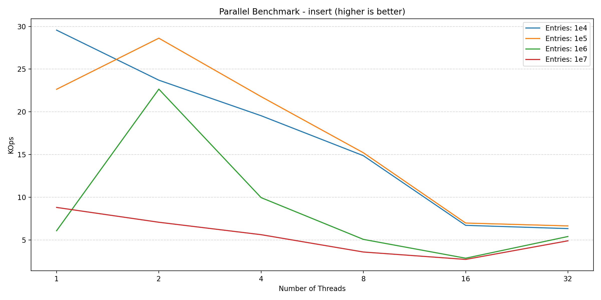
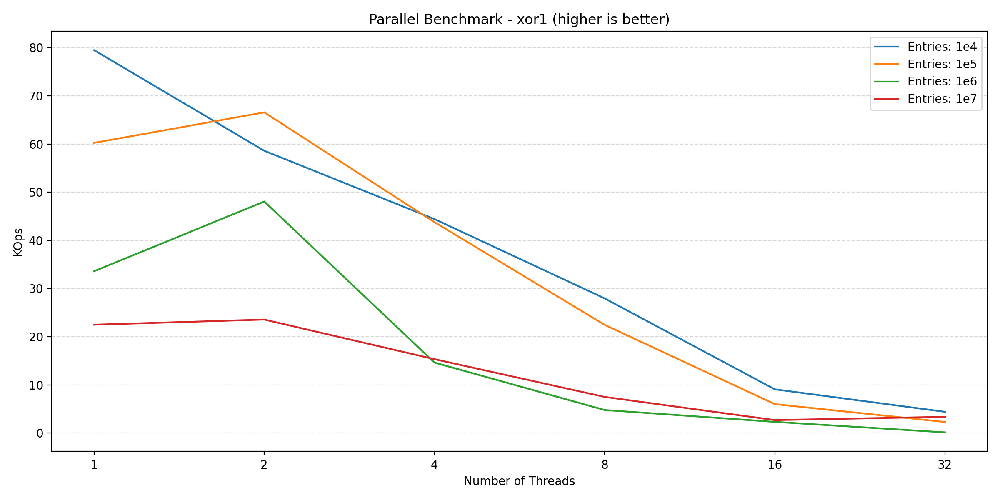
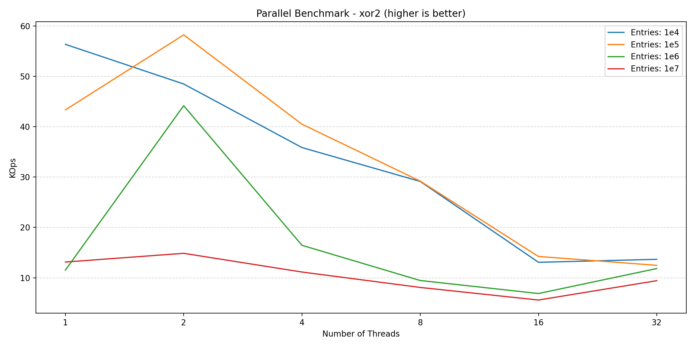

Here we see an increase going from 1 to 2 threads, but adding more threads after this point hurts the performance. This is likely due to lock contention inside of the database engine, which is expected. Finally, looking at the new blockset benchmark (which is a mix of read and write):

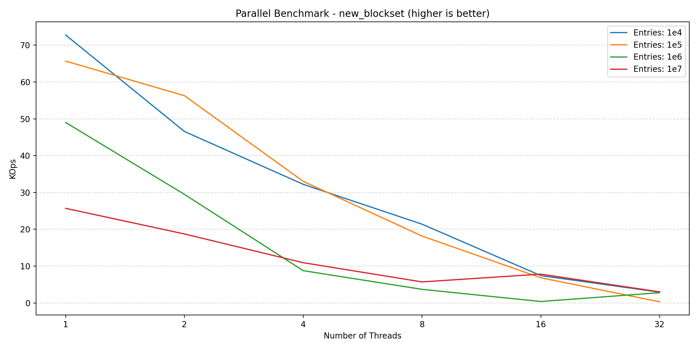

We see a similar story to that of the write benchmarks. So for a read-heavy workload, parallelization can provide significant benefits, but as soon as the workload has to perform writes, the benefits diminish. This is especially due to the small transaction size (as we'll show in the next section), which is a requirement for data consistency.

In conclusion; while parallelization can improve performance for read-heavy workloads, it harms write-heavy workloads, making it a trade-off to be considered.

## Transaction batches

Looking at the plots between parallel and pragmas, we see a huge difference in the y-axis scale due to how the transactions are controlled. In the parallel benchmark, we have to apply aggressive batching to keep the database in a consistent state. This is not a problem in the pragmas benchmark, since everything is performed in the same thread, requiring no synchronization. However, in Duplicati, we also commit the transaction at multiple points to ensure that the database is consistent in the event of a crash. This benchmark tries different batch sizes to see the impact of the batching strategy on performance.

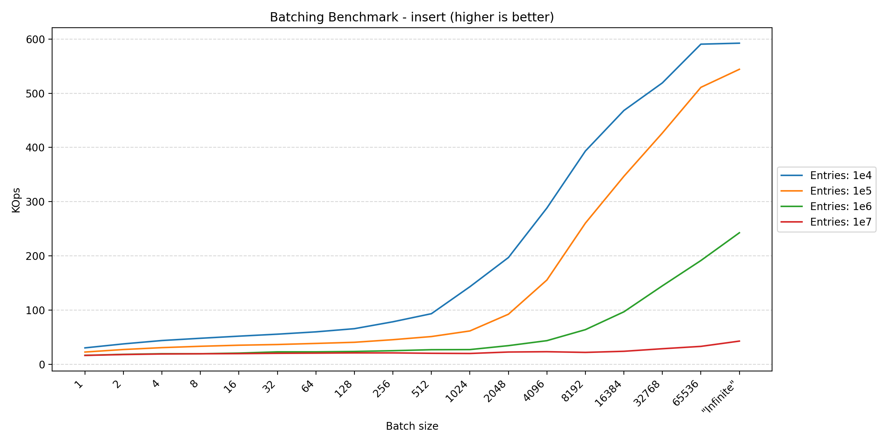
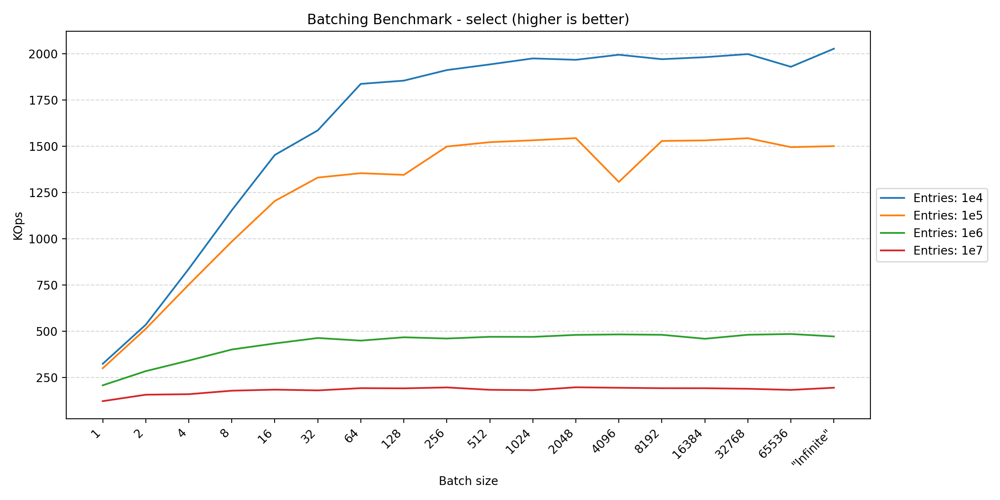
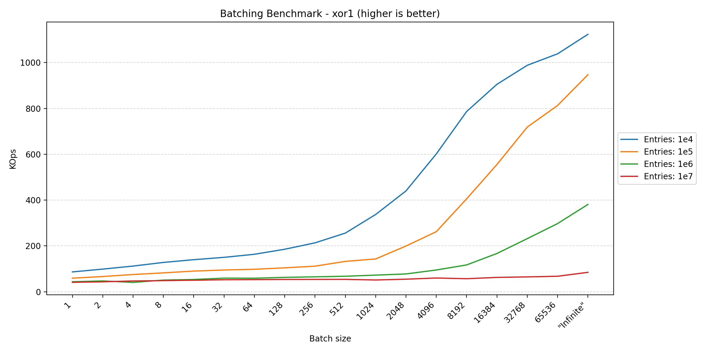
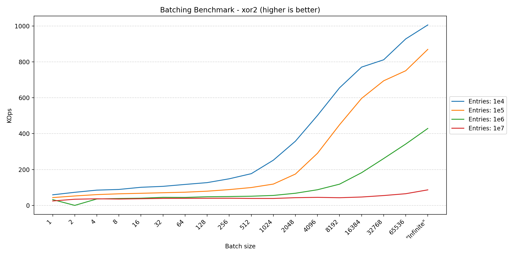

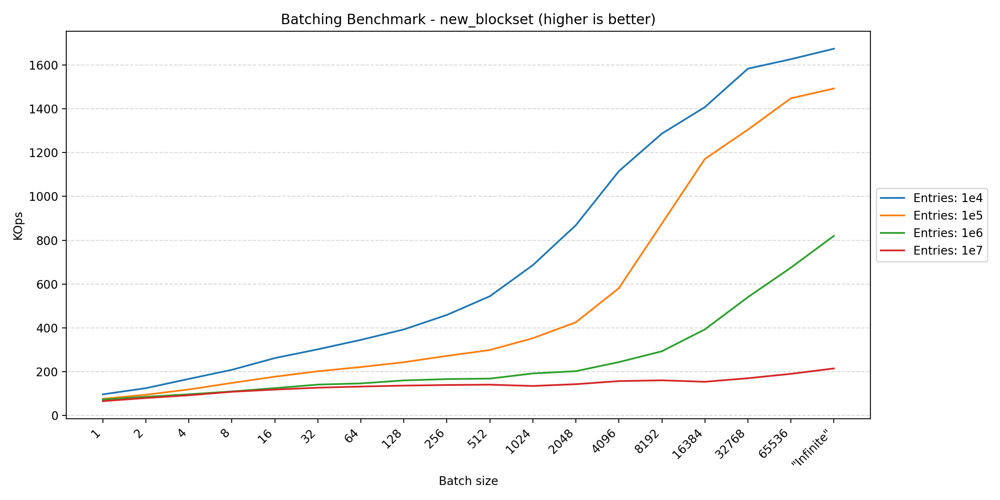

Here we see that anything that writes data benefits from larger batch sizes, as this reduces the overhead of transaction management. However, for read-heavy operations, the performance tends to plateau around 256. In short, if one wants to maximize performance, one should have as large transactions as possible. Usually other factors have a greater influence on when to commit a transaction, such as keeping writes visible during concurrent accesses or data consistency in the event of a crash.
The fact that the join benchmark seems unphased by batch size makes sense, as each statement already affects multiple rows, reducing the impact of transaction overhead.

# Backends

Having found the most performant options, we'll transition back to Duplicati by returning to the C# implementation.
In .NET, there are multiple backends to choose from when working with SQLite databases, leading to another tunable aspect.
We'll do a short look into each of them, their pros/cons, and their performance characteristics.

## Duplicati's shipped SQLite

We'll look into this to provide a baseline to compare against without any pragmas, as this is closer to what Duplicati already uses.
Duplicati's shipped SQLite features prebuilt binaries for all of the architectures that Duplicati supports.
However, due to previous compatibility issues, the SQLite version is not the latest, leading to some missing features found in newer versions.
This also means that we have to build the binaries with each of our releases. This gives greater control over the build process, at the cost of increased maintenance overhead.

## Microsoft.Data.Sqlite

This is a newer ADO.NET provider for SQLite that is designed to be more modern and efficient, and is generally recommended for new development.
It is Microsoft's own fork of System.Data.SQLite and aims to provide a more streamlined and performant experience.
Like Duplicati, it ships with prebuilt binaries for most architectures - even more than Duplicati's.
It is one of the more strict ADO.NET providers, enforcing better practices and providing more consistent behavior.
This does also mean that it may be less flexible in certain scenarios, requiring more effort to work around its limitations.
We see this as a good thing, as side effects are minimized, making the code, and thus intent, more explicit.

Microsoft.Data.Sqlite also supports asynchronous operations, which can improve performance in scenarios where the database is accessed concurrently.
This is especially useful for Duplicati, since most of its internal code already leverages asynchronous programming.
We will benchmark the performance of asynchronous operations compared to synchronous operations.
The asynchronous backend also allows for more efficient use of resources, as it can free up threads while waiting for I/O operations to complete.
It also allows for cancellation, improving the responsiveness of the application when a user pauses or cancels a long-running operation.

## sqlite3 C API through PInvoke

This is a low-level approach that involves using PInvoke to call the SQLite C API directly from .NET. While this can offer the best performance.
This approach is generally not recommended unless absolutely necessary since this involves dealing with memory management and marshaling data between managed and unmanaged code, further leading to unsafe code.
So this has to be extremely beneficial in terms of performance to justify the complexity and added risk, but proves an interesting comparison to the overhead of C# compared to C++ since they're now both using the same underlying SQLite library.

## System.Data.SQLite

This is the "default" ADO.NET provider for SQLite. It's been around for a long time and is well-tested, but it has some limitations, especially when it comes to asynchronous operations.
Switching to this backend would require some changes to the codebase, particularly around how database connections and commands are handled.
So to make this switch, it has to be worth it.

## Results

We'll keep this short by focusing on the 1e7 runs:

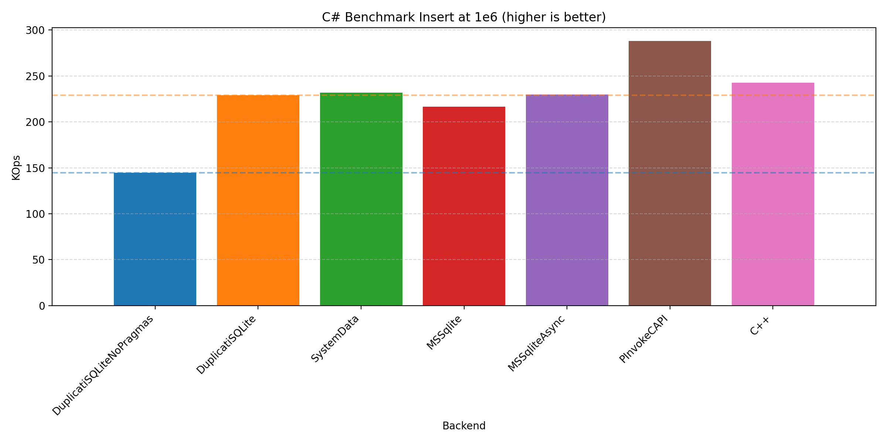


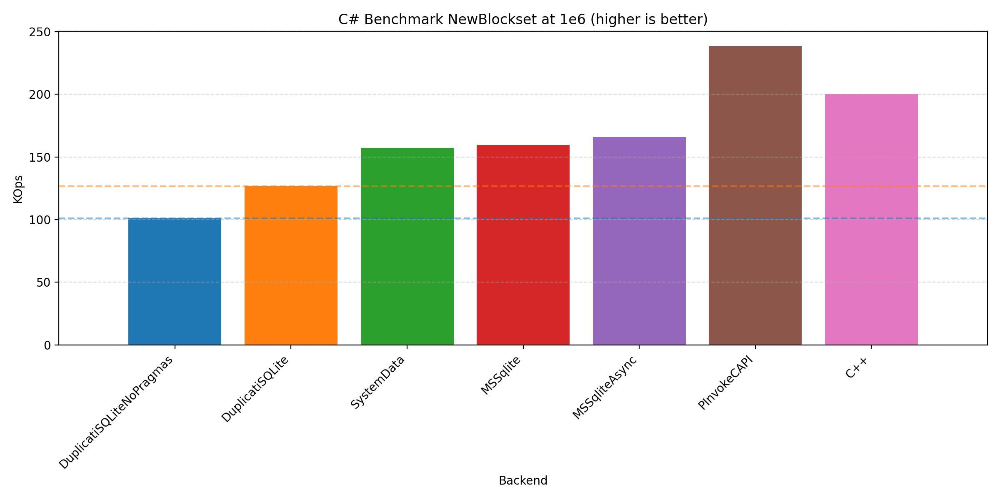

In all cases, we see that the C++ runs are the fastest, but not by a large margin, indicating that the C# implementations are quite competitive, even beating the C++ run through the PInvoke interface in the 'Select' benchmark.
Across the different benchmarks, the performance differences are relatively small, suggesting that the C# implementations are well-optimized.

While the overall winner is synchronous Microsoft.Data.Sqlite, the asynchronous version is not far behind, making it a favorable candidate for a new backend due to its added asynchronous capabilities.

# Duplicati revisit

The Microsoft.Data.Sqlite is a seemingly good candidate for Duplicati:

- It is bundled with the newest SQLite binaries, so we don't have to compile it ourselves.
- It is a modern first-class ADO.NET provider for SQLite, offering better performance and more features than the older System.Data.SQLite.
- It has a more stringent interface, making it easier to work with and reducing the likelihood of errors by reducing implicit side-effects.
- It has great asynchronous support, making it easier to build responsive applications and performs well with high-concurrency workloads, such as Duplicati.

All of these pros triggered the integration of this as a new backend in [PR 6360](https://github.com/duplicati/duplicati/pull/6360) available in [Duplicati Canary 2.1.0.121](https://github.com/duplicati/duplicati/releases/tag/v2.1.0.121_canary_2025-07-07) onwards.

While not a complete benchmark, we'll quickly compare the performance of backup, recreate, restore, and delete in [the previous version (2.1.0.120)](https://github.com/duplicati/duplicati/releases/tag/v2.1.0.120_canary_2025-06-24) compared to [the version with the new backend (2.1.125)](https://github.com/duplicati/duplicati/releases/tag/v2.1.0.125_canary_2025-07-15). We'll be using the medium dataset outlined in the [restore rework blog post](https://forum.duplicati.com/t/blog-post-cut-restore-times-by-3-8x-a-deep-dive-into-our-new-restore-flow/20415). We'll also lower the volume size to 1mb and block size to 1 kb to really stress the database.

| Metric            | Previous Version (2.1.0.120) | New Version (2.1.125) | Speedup |
| ----------------- | ---------------------------- | --------------------- | ------- |
| Backup time (s)   |                              |                       | A %     |
| Recreate time (s) |                              |                       | B %     |
| Restore time (s)  |                              |                       | C %     |
| Delete time (s)   |                              |                       | D %     |

TODO ABCD numbers

# Future work

- While this blog post focuses on SQLite, it has still been with Duplicati in mind. We have made a light investigation into the effects on Duplicati, but a more extensive analysis is needed to fully optimize database accesses. Some parts will require new database schemas, some modifications to the queries and indices, and potentially new manual caching strategies.

- Microsoft.Data.Sqlite allows for bulk inserts. Maybe there's value in keeping a small batch in memory, flushing it to the database periodically. This is only true if the bulk inserts on their own are faster than individual inserts.

# Conclusion

In this blog post we've dived into the performance of SQLite through various configurations in C++ and through different .NET providers.

Changing the schema can have a significant impact on performance, but the one already employed by Duplicati seems to strike a good balance between complexity and performance. There is a potential for about 20 % improvement by changing the schema, which is left for later as it requires some restructuring of the codebase.

We've seen how pragmas can be used to squeeze extra performance out of SQLite, providing over 5x improvements in certain scenarios.

We've seen how parallel queries can further enhance read performance, but severely negatively impact write performance due to increased contention. If concurrent writing to the database is required, it may be worthwhile to manually implement caching strategies, both to batch writes into larger transactions, and to minimize the time the database is locked. Currently in Duplicati, parallel database access is only leveraged in the restore flow, which is a read-heavy operation database-wise.

We've seen how large batches can significantly improve performance (up to 66x), especially for write-heavy operations. Like with the parallel effects, it could be worthwhile to group writes into a cached batch, flushing it to the database periodically.

Finally, we've seen how C# is competitive to C++ in terms of SQLite performance. We've also seen how the Microsoft.Data.Sqlite library provides better performance, a more stringent interface, and improved support for asynchronous operations, which primed the new backend implemented in [PR 6360](https://github.com/duplicati/duplicati/pull/6360) available in [Duplicati Canary 2.1.0.121](https://github.com/duplicati/duplicati/releases/tag/v2.1.0.121_canary_2025-07-07) onwards.

Implementing the new backend along with the pragmas, Duplicati in a database stressing state now performs Ax, Bx, Cx, and Dx times better for backup, recreate, restore, and delete operations respectively.

TODO ABCD numbers
